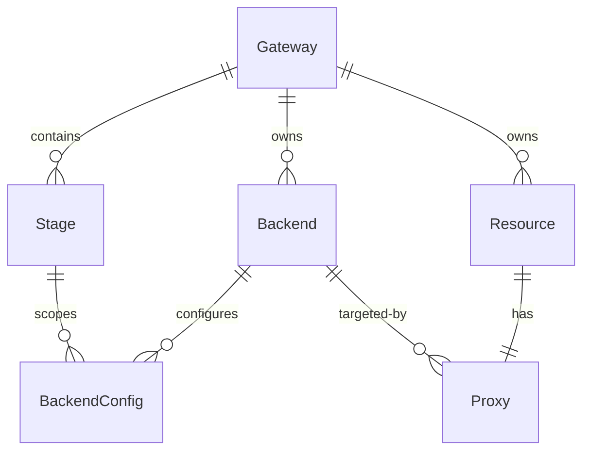

# AI Gateway 领域模型设计

> 状态：需求讨论稿。本文记录当前已确认的建模结论，后续讨论可继续补充。
>
> 主要实现范围：`src/dashboard`。模型请求出站 Header 隔离需要
> `blueking-apigateway-apisix` 配套实现。

## 1. 设计结论

AI Gateway 继续复用现有网关、环境、后端服务、资源和发布模型，通过不可变的 `kind` 字段区分业务类别。

- 新增 AI Gateway 网关类别。
- 模型服务不新增 `ModelBackend` / `ModelBackendConfig` 数据表，而是复用 `Backend` / `BackendConfig`。
- `Backend.kind` 区分普通后端服务和模型服务。
- `Resource.kind` 区分普通 API 和模型代理 API。
- `Proxy` 仍然只保留一个 `backend` 外键，不增加 `model_backend` 外键。
- `Backend.type` 和 `Proxy.type` 保持现有的协议语义，不用于区分普通服务和模型服务。
- Service 和 Route 插件根据 Backend.kind / Resource.kind 使用显式兼容策略，模型链路采用允许列表，未知插件默认不下发。
- 模型请求的出站 Header 采用默认拒绝策略；模型访问日志默认只记录统计摘要，不记录 Prompt 和模型回复正文。
- 模型代理 API 不能配置为 MCP Server 的工具资源，MCP Server 只允许关联 `Resource.kind=standard` 的 API。
- 模型代理 API 保留用户配置的外部 Resource.path，HTTP Method 固定为 POST；第一期只支持 Chat Completions。
- Chat Completions 默认同时支持普通响应和流式响应，不增加网关产品层的流式开关或额外限制。
- 每个模型 instance 必须配置固定模型，客户端请求中的 model 不参与实际模型选择。

## 2. 模型关系



### 2.1 Gateway

AI Gateway 与普通网关、可编程网关共用网关创建入口和 `Gateway` 模型，只通过网关类别区分。

约束：

- AI Gateway 创建后，网关类别不允许修改。
- AI Gateway 可同时拥有普通后端服务和模型服务。
- 普通网关和可编程网关不允许创建或同步模型服务、模型代理 API 等 AI 配置。
- 可编程网关仍然只能从页面创建，不作为自动化同步可创建的网关类别。

### 2.2 Backend

`Backend` 新增字符串类型、不可变的 `kind` 字段：

```text
Backend.kind = standard | ai
```

- `standard`：普通后端服务。
- `ai`：模型服务，只允许归属于 AI Gateway。

`Backend.type` 继续表示传输协议：

```text
Backend.type = http | grpc
```

模型服务的实际传输协议为 HTTP，因此当 `Backend.kind=ai` 时，`Backend.type` 固定为 `http`，不需要在模型服务产品接口中暴露该字段。

`Backend.kind` 创建后不能修改。不允许将已有普通后端服务转换为模型服务，反之亦然。

### 2.3 Backend 名称空间

`Backend` 继续保持 `(gateway, name)` 唯一约束。普通后端服务与模型服务共享名称空间，同一网关下不允许同名。

该约束使两类服务共享同一套全局唯一 ID 和名称，避免以下问题：

- APISIX Service ID 冲突。
- controller 中需要两套 Backend 到 Service 的映射。
- `bk-backend-context` 需要对 ID 和名称做运行时编码。
- 访问日志和 metrics 按后端名称过滤时混入另一类服务的数据。

相应的产品限制是：AI Gateway 自动创建普通 `default` Backend 后，不能再创建名为 `default` 的模型服务。

### 2.4 BackendConfig

`BackendConfig` 保持现有的环境维度和唯一约束：

```text
Gateway 1 --- N Backend
Backend 1 --- N BackendConfig
Stage   1 --- N BackendConfig

unique(gateway, backend, stage)
```

`BackendConfig.config` 的数据结构由 `Backend.kind` 决定，`config` 内不重复保存 `kind` 或 APISIX 插件类型。

普通 BackendConfig 继续使用现有结构：

```json
{
  "type": "node",
  "timeout": 30,
  "loadbalance": "roundrobin",
  "hosts": [
    {
      "scheme": "http",
      "host": "example.com",
      "weight": 100
    }
  ]
}
```

模型 BackendConfig 使用 `instances` 数组：

```json
{
  "timeout": 30000,
  "instances": [
    {
      "name": "primary",
      "provider": "openai",
      "weight": 1,
      "auth": {
        "header": {
          "Authorization": "Bearer <secret>"
        }
      },
      "options": {
        "model": "gpt-4o"
      }
    }
  ]
}
```

`instances[]` 直接采用 [APISIX `ai-proxy-multi.instances`](https://apisix.apache.org/docs/apisix/plugins/ai-proxy-multi/) 的字段结构，不增加 `ModelInstance` 数据表，也不定义一套产品中间字段再转换。

第一期约束：

- 顶层只允许 `instances` 和 `timeout`，拒绝其他字段。
- `instances` 必须存在。
- `len(instances) == 1`。
- `instances[0].provider` 只允许 `openai`、`deepseek`、`openai-compatible`。
- `instances[0].options.model` 必须是非空字符串。
- 不允许接受无法转换为单实例 `ai-proxy` 语义的多实例策略，不得静默丢弃用户配置。

第一期 provider 允许列表由 dashboard 代码显式维护，不直接等同于 APISIX 当前支持的全部 provider。APISIX 后续新增 provider 或升级版本时不能自动进入产品 API，必须同步增加表单、JSON Schema、凭证处理和发布转换测试后才能开放。

第一期 instance 使用显式最小字段集，JSON Schema 拒绝未声明字段：

| 字段 | 约束 |
| --- | --- |
| `name` | 必填，非空字符串；作为未来开放多 instance 时的稳定标识 |
| `provider` | 必填，只允许第一期 provider 允许列表 |
| `weight` | 必填且固定为 `1` |
| `auth.header` | 允许配置字符串 Header 映射；Header value 逐值加密和脱敏 |
| `options.model` | 必填且非空；`options` 不接受其他字段 |
| `override.endpoint` | 仅 `openai-compatible` 允许且必须提供 |

`openai` 和 `deepseek` 使用 APISIX 内置官方 endpoint，不允许配置 `override`。第一期不开放：

- `priority`。
- `checks`。
- `provider_conf`。
- `auth.query` 和 `auth.gcp`。
- `options` 中除 `model` 外的其他字段。

Model BackendConfig 顶层只开放 `timeout`：

- `timeout` 使用 APISIX 语义，单位为毫秒，必须是正整数。
- Web serializer 或归一化入口在用户未提供时显式写入默认值 `30000`，JSON Schema 只校验归一化结果，不负责注入默认值。
- `ssl_verify` 固定为 `true`，不允许通过 Model BackendConfig 关闭。
- `keepalive`、`keepalive_timeout`、`keepalive_pool` 使用 APISIX 默认值，第一期不对用户开放。
- `logging` 不属于用户 BackendConfig，由 controller 固定生成 `summaries=true`、`payloads=false`。
- 第一期不接受 `balancer`、`fallback_strategy` 等多 instance 顶层字段。

#### 2.4.1 auth 凭证

`instances[].auth.header` 保持 APISIX 原生对象结构，Header value 复用 `DataPlane.etcd_configs` 的处理方式，直接通过项目现有 `get_crypto().encrypt()/decrypt()` 逐值加解密后保存在 BackendConfig.config JSONField 中，不增加自定义密文 envelope、独立凭证表或加密字段。

provider 约束：

- `openai`、`deepseek` 必须提供非空 `Authorization` Header。
- `openai-compatible` 允许空的 `auth.header`，也允许配置自定义 Header。
- Header key 按 HTTP 语义进行大小写不敏感的重复校验。

写入流程：

1. serializer 对用户输入的明文 auth 结构和 provider 规则进行校验。
2. 更新时，将掩码值和未提供的 Header 与数据库中已有密文合并。
3. 只加密新增或发生变化的 Header value，避免重复加密和无意义的配置 diff。
4. 合并后的完整 config 再执行 Model BackendConfig JSON Schema 校验并入库。

更新语义：

- Header value 长度小于 4 时输出 `****`；否则输出“前两位 + `****` + 后两位”，该掩码值表示保留已有凭证。
- 更新请求中未提供某个已有 Header，也表示保留，避免 PUT 或同步客户端读取不到明文后误删凭证。
- 提供新的非掩码 value 表示替换并重新加密。
- 显式提交空的 `auth.header` 表示清空全部 Header；仅 `openai-compatible` 允许保存空认证，`openai` 和 `deepseek` 应校验失败。

读取和使用约束：

- Web API、`/api/v2/sync` 响应、导入导出、审计事件和配置 diff 对所有 auth Header value 统一按上述规则输出部分掩码，不得输出完整明文或数据库密文。
- controller 发布时只在内存中解密，将明文 auth 注入生成的 `ai-proxy` 配置；解密失败必须终止发布。
- controller、发布记录、异常消息和日志不得序列化解密后的 auth。
- APISIX 运行配置最终需要包含可用凭证，因此 APISIX 与 etcd 属于凭证信任边界，必须依赖其访问控制和日志脱敏，不能把 dashboard 数据库加密误认为端到端加密。
- `save()`、`bulk_create()`、`bulk_update()` 等 BackendConfig 写入入口除 JSON Schema 校验外，还必须执行相同的凭证加密规则；继续禁止通过 `QuerySet.update(config=...)` 绕过。

模型选择权属于 Model BackendConfig：

- 客户端 Chat Completions 请求可以省略 `model`，也可以为兼容 SDK 而携带该字段。
- controller 生成 `ai-proxy` 配置后，APISIX 必须使用 `instances[0].options.model` 覆盖客户端请求中的 model。
- 不允许客户端借用当前 Model Backend 的凭证选择其他模型。
- 可观测数据分别保留客户端请求模型和最终调用模型，不能把两者合并成一个字段。

后续支持多实例时，只需放宽 `instances` 数量限制并开放对应的负载均衡、重试、故障转移和健康检查配置，不需要迁移存储结构。

### 2.5 BackendConfig 配置校验

BackendConfig 配置需要同时经过输入层校验和归一化 JSON 校验。

Web API 的 serializer 继续使用具体表单字段：

```text
StandardBackendConfigSLZ
    -> hosts / timeout / loadbalance / checks / ...

AIBackendConfigSLZ
    -> instances / ...
```

serializer 负责输入字段类型、必填项、默认值、可读错误和业务语义校验。默认值必须由 serializer 或归一化函数显式生成，JSON Schema 不负责向配置中注入默认值。

serializer 将输入转换为最终 `BackendConfig.config` JSON 后，必须再根据 Backend.kind 执行 JSON Schema 校验：

```text
Backend.kind=standard
    -> STANDARD_BACKEND_CONFIG_SCHEMA

Backend.kind=ai
    -> AI_BACKEND_CONFIG_SCHEMA
```

JSON Schema 是“归一化后、准备入库的 `BackendConfig.config`”的权威契约。Web serializer、`/api/v2/sync`、内部服务和 controller 都必须以该契约为准。

Schema 和 validator 定义在代码内的独立 Python 模块中：

```text
apigateway/core/backend_config_schema.py
```

该模块：

- 定义 `STANDARD_BACKEND_CONFIG_SCHEMA` 和 `AI_BACKEND_CONFIG_SCHEMA`。
- 按 Backend.kind 预先实例化对应的 `jsonschema` validator。
- 在模块加载或测试时校验 Schema 本身的合法性。
- 对外提供统一的 `validate_backend_config(kind, config)` 入口。
- 校验失败时返回包含 JSON 路径的领域错误，API 和发布流程再转换为各自的对外错误。

该方案不复用现有 `Schema` 数据表，不增加 Schema 外键，不从数据库动态加载 BackendConfig Schema。

JSON Schema 主要负责：

- 字段类型与必填字段。
- 数组长度与嵌套结构。
- 拒绝未声明字段，避免字段拼写错误被静默入库。
- 拒绝 Backend.kind 与 config 结构不匹配的配置。
- 第一期模型配置的 `instances` 数量必须等于 1。

forbidden host、scheme 与 Backend.type 的关系、provider 能力约束等非结构化业务规则，仍由 serializer 或业务 validator 负责。

入库校验要求覆盖所有 ORM 写入方式：

- `BackendConfig.save()` 必须校验当前 config。
- `BackendConfig.objects.bulk_create()` 必须逐项校验。
- `BackendConfig.objects.bulk_update()` 修改 config 时必须逐项校验。
- 不允许通过 `QuerySet.update(config=...)` 绕过校验；如需要该类批量更新，必须提供经过同一 JSON Schema 校验的专用入口。
- 发布时再执行一次相同的 JSON Schema 校验，防止历史脏数据或绕过常规入口的数据进入 APISIX。

需要通过契约一致性测试防止 serializer 与 JSON Schema 漂移：所有 BackendConfig serializer 的合法归一化输出都必须通过对应 kind 的 JSON Schema，而关键非法输入必须被两层校验中至少一层拒绝。

## 3. Resource 与 Proxy

### 3.1 Resource.kind

`Resource` 新增字符串类型、不可变的 `kind` 字段：

```text
Resource.kind = standard | ai
```

- `standard`：普通 API。
- `ai`：模型代理 API（LLM API），只允许归属于 AI Gateway。

`Resource.kind` 需要显式存储，不从 Backend 临时推导，原因包括：

- 资源列表需要直接展示和过滤普通 API / 模型代理 API。
- 两类资源的创建、更新输入结构不同。
- 资源版本快照需要稳定记录历史资源类别。
- 导入导出和 controller Route 转换需要以资源类别为明确分支条件。

### 3.2 Resource 与 Backend 约束

`Proxy` 继续只通过现有 `backend` 外键关联 `Backend`。

```text
Resource.kind == Proxy.backend.kind
```

具体约束：

- `Resource.kind=standard` 必须关联 `Backend.kind=standard`。
- `Resource.kind=ai` 必须关联 `Backend.kind=ai`。
- Resource 和 Backend 必须归属于同一 Gateway。
- `Resource.kind` 创建后不允许修改。
- 更新、导入或同步已有资源时，如果输入 kind 与存量记录不一致，应报错，不能静默修改资源类别。

### 3.3 Proxy.type 与 Proxy.config

`Proxy.type` 继续表示代理协议，两类资源均保持为 `http`，不增加 `llm` 或 `model` 类型。

- 普通 API 的 `Proxy.config` 继续保存普通后端请求方法、转发路径、子路径匹配和超时等配置。
- 模型代理 API 不使用普通后端路径改写配置，`Proxy.config` 为空对象，其 Proxy 仅负责关联模型 Backend。

模型代理 API 的入口协议：

- 外部 `Resource.path` 仍由用户配置，用于生成 APISIX Route 的匹配 URI，因此同一 Stage 下可以通过不同 path 暴露不同模型 Backend。
- `Resource.method` 固定为 `POST`，Web API、导入和 `/api/v2/sync` 不接受其他 Method。
- 第一阶段只支持 Chat Completions，不支持 Embeddings 或由客户端通过 URI 选择其他模型 API 类型。
- 客户端未开启流式时返回普通 Chat Completions 响应，开启流式时按模型协议返回 SSE；两种模式使用相同的 Resource 和 Model BackendConfig，不增加独立配置。
- 模型 Resource 不配置普通 Proxy 的转发 path、转发 method、match_subpath 或 route timeout；模型请求目标和 timeout 由 Model BackendConfig 负责。

## 4. 创建、更新与环境矩阵

### 4.1 Web 端

数据表复用不影响产品概念分离。Web API 可继续提供“后端服务”和“模型服务”两个入口与两套输入校验，但内部均读写 `Backend` / `BackendConfig`。

- 普通后端服务接口只查询 `Backend.kind=standard`。
- 模型服务接口只查询 `Backend.kind=ai`。
- 从 Web 创建 Backend 时，必须一次提交所有已有 Stage 的 BackendConfig，保持完整环境矩阵。

### 4.2 环境矩阵与发布完整性

BackendConfig 仍然是 Backend 在每个 Stage 下的配置。

- Web 创建或编辑流程保持完整矩阵。
- `/api/v2/sync` 按单个 Stage 同步，可以在同步过程中短暂形成不完整矩阵。
- 完整矩阵是发布就绪条件，而不是要求数据库任意时刻都满足的硬约束。
- 发布时，资源关联的 Backend 必须存在当前 Stage 的 BackendConfig，否则发布失败。

## 5. `/api/v2/sync` 同步协议

### 5.1 网关同步

网关同步输入新增字符串 `kind`：

```text
kind = normal | ai_gateway
```

兼容和约束：

- `kind` 缺省时默认为 `normal`，兼容存量自动化同步客户端。
- 自动化同步只允许创建普通网关或 AI Gateway，不允许创建可编程网关。
- 更新已有网关时，忽略请求中的 `kind`，不修改已有网关类别。
- 是否允许同步 AI 配置，以数据库中已存储的 Gateway kind 为准，不信任更新请求中的 `kind`。

### 5.2 Stage 同步

Stage 同步保留现有 `backends` 字段，并增加 `modelBackends`（Python 内部可表示为 `model_backends`）。

- `backends` 只同步 `Backend.kind=standard` 的 BackendConfig。
- `modelBackends` 只同步 `Backend.kind=ai` 的 BackendConfig。
- 只有 AI Gateway 允许传入 `modelBackends`。
- 模型 Backend 按 `(gateway, name)` 匹配或创建，并 upsert 当前 Stage 的 BackendConfig。
- 如果同名 Backend 已存在但 kind 不一致，同步失败，不修改存量 Backend.kind。
- 普通网关传入任何 `modelBackends` 配置时应报错，不能静默忽略。

同步采用增量 upsert 语义，不把 Stage 请求解释为 BackendConfig 的完整集合：

- 普通网关保持现有约束：`backends` 必填且至少包含一项，`modelBackends` 禁止传入。
- 创建 AI Gateway 的 Stage 时，`backends` 和 `modelBackends` 至少一个包含配置；允许只配置模型 Backend，不要求创建无实际用途的普通 BackendConfig。
- 更新 AI Gateway 的 Stage 时，未提供某个字段表示不修改该类 BackendConfig；提供非空数组时，仅 upsert 数组中列出的当前 Stage 配置。
- 更新时不允许用空数组表示删除；未列出的 Backend 和 BackendConfig 保持不变。删除不属于 Stage 同步协议的职责。
- 两个字段的处理应处于同一数据库事务中，任一配置校验或写入失败时整次 Stage 同步回滚。

## 6. Resource 导入、导出与同步

模型代理 Resource 与普通 Resource 使用相同的资源列表、导入导出和 `/api/v2/sync/gateways/{gateway_name}/resources/` 入口。

OpenAPI 导入导出在现有资源扩展对象中增加 `kind`：

```yaml
x-bk-apigateway-resource:
  kind: ai
  backend:
    name: model-service-name
```

字段值为 `standard | ai`。不增加独立的 `x-bk-apigateway-resource-kind` 扩展，也不使用重复语义的 `resourceKind`。

约束：

- 普通 Resource 导出时省略 `kind`，保持现有普通资源的导出内容不变；导入时未提供 `x-bk-apigateway-resource.kind` 则按 `standard` 处理。
- 普通 Resource 只允许引用普通 Backend。
- 模型 Resource 只允许引用模型 Backend。
- 模型 Resource 导出时必须显式写入 `kind: ai`，并且只导出关联模型 Backend 的名称，不导出 BackendConfig 中的 endpoint、auth、model 等环境配置。
- 导入模型 Resource 时，同名且 `kind=ai` 的 Backend 必须已存在当前 Gateway 下，否则导入失败。
- 更新已有 Resource 时，输入 kind 必须与存量 Resource.kind 一致。

### 6.1 MCP Server 资源限制

MCP Server 只允许使用普通 API 作为工具资源：

```text
MCPServer.resource_names -> Resource.kind=standard
```

`Resource.kind=ai` 的模型代理 API 不允许配置到 MCP Server。该限制是服务端领域约束，不能只依赖前端隐藏。

当前 MCP Server 按 `resource_names` 保存工具资源，并以 Stage 已发布的 ResourceVersion 判断资源是否有效。新增 Resource.kind 后，MCP 专用的有效资源集合必须同时满足：

- 资源存在于目标 Stage 当前使用的 ResourceVersion。
- 快照中的 `Resource.kind=standard`。
- 旧快照缺少 kind 时按 `standard` 处理。

不能直接修改通用的 `get_resource_names_set()` 使其全局排除模型资源，因为其他资源权限和发布流程仍可能需要处理模型 API。应增加 MCP 专用查询入口，或为底层快照查询增加显式 kind 条件，并由所有 MCP 路径复用。

约束需要覆盖以下入口：

- MCP Server 创建和更新时，候选 API 列表只返回普通 API。
- Web API 即使直接收到模型 API 的 resource_name，也必须返回校验错误，不能静默过滤后保存。
- `/api/v2/sync` 同步 MCP Server 时，`resource_name_to_schema` 或等价的有效资源映射只包含普通 API。
- 异步发布后保存 MCP Server 配置时再次校验，避免延迟任务或内部调用绕过入口 serializer。
- Stage 发布变更检查把模型 API 视为 MCP 不可用资源；脏数据中已关联的模型 API 应显示为需要移除的资源。
- MCP 工具列表和运行时工具加载再次过滤模型 API，保证历史脏数据不会被暴露为 MCP Tool。
- MCP Server 权限同步只为普通 API 创建 `AppResourcePermission`，不得为模型 API 创建虚拟 MCP 应用权限。

MCP 有效资源判断以 ResourceVersion 快照中的 kind 为准，而不是查询当前 Resource 表临时推导，确保 MCP Server 配置、Stage 发布版本和实际运行工具使用同一份资源定义。

## 7. 资源版本快照

ResourceVersion 快照需要保存 `Resource.kind`，并继续使用单一 Backend 引用：

```json
{
  "id": 1,
  "kind": "ai",
  "proxy": {
    "type": "http",
    "backend_id": 10,
    "config": "{}"
  }
}
```

兼容规则：

- 存量 Resource 和存量资源版本在迁移或读取时缺少 kind，均视为 `standard`。
- 快照不增加 `model_backend_id`，两类资源统一使用 `proxy.backend_id`。
- 发布时以快照 Resource.kind 决定 Route 转换逻辑，并校验当前 Backend.kind 与快照一致。

## 8. Controller 发布转换

### 8.1 ReleaseData

`ReleaseData` 不应只返回 `backend_id -> config`，而应为 Service 转换提供包含 Backend 元数据的环境配置：

```text
StageBackendConfig
├── backend_id
├── backend_name
├── backend_kind
├── backend_type
└── config
```

### 8.2 ServiceConvertor

`ServiceConvertor` 负责编排，根据 Backend.kind 选择不同的 Service 构建逻辑：

```text
ServiceConvertor
├── StandardBackendServiceBuilder
│   ├── 构建普通 upstream
│   └── 普通 Service 插件集合
└── AIBackendServiceBuilder
    ├── 不构建普通 upstream
    ├── 构建 ai-proxy / ai-proxy-multi
    └── AI Service 插件集合
```

普通 Service 与模型 Service 的 stage 默认插件列表不强制相同。插件构建应采用以下结构，不能先构建普通 Service 插件列表再删除差异项：

```text
common stage plugins + standard-only plugins
common stage plugins + ai-only plugins + ai-proxy
```

`ai-proxy` / `ai-proxy-multi` 是当前模型 BackendConfig 的业务插件，不属于无条件的 stage 默认插件。

### 8.3 插件适用性与安全边界

模型 Service 不能在普通 Service 插件列表的基础上只增加 `ai-proxy`。`ai-proxy` 会绕过普通 NGINX upstream，通过 Lua HTTP 客户端直接访问模型服务，因此插件是否适用需要同时检查：

- 是否依赖 `upstream_*` 变量或普通 upstream 生命周期。
- 是否修改将被发送给模型服务的请求 Header。
- 是否会缓存、拼接或改写 SSE 流式响应。
- 是否会在日志中记录 Prompt、模型回复或模型凭证。

#### 8.3.1 Service 插件 Profile

Service 插件使用三组显式 Profile：

```text
common service plugins
+ standard-only service plugins

common service plugins
+ ai-only service plugins
```

第一期分类如下：

| 分类 | 插件 | 模型链路处理 |
| --- | --- | --- |
| 通用网关能力 | `bk-real-ip`、`bk-auth-validate`、`bk-auth-verify`、`bk-permission`、`bk-delete-sensitive`、`bk-delete-cookie`、`bk-stage-context`、`bk-resource-context`、`bk-backend-context`、`bk-debug`、租户校验、并发限制 | 保留；其中租户等插件写入请求 Header 的行为不等于允许向模型服务透传 |
| 通用可观测性 | `prometheus`、`bk-request-id`、`bk-response-check`、`file-logger` | 保留，但使用模型日志 Profile 和 LLM metrics 配置 |
| 普通 Service 专用 | `bk-jwt`、`bk-break-recursive-call`、`bk-log-context`、`bk-error-wrapper` | 模型 Service 不下发 |
| 模型 Service 专用 | `ai-proxy` / `ai-proxy-multi`、模型出站 Header 过滤能力 | 仅模型 Service 下发，且由 controller 自动生成 |

具体约束：

- `bk-jwt` 生成的 `X-Bkapi-Jwt`、`X-Bkapi-App` 是普通 Backend 身份透传协议，不能发送给模型厂商。
- `bk-break-recursive-call` 会生成 `X-Bkapi-Instance-Id`。第一期模型 Service 不下发该插件；如果后续允许模型 endpoint 指向另一个网关，需要重新设计不泄露内部实例标识的递归检测协议。
- `bk-error-wrapper` 依赖普通 NGINX upstream 的状态、连接耗时和收发字节数，不能用于 `ai-proxy` 的 Lua HTTP 请求。
- `bk-log-context` 的 upstream 字段在模型链路中不准确，并可能记录 Prompt 或流式响应首段，模型 Service 不下发。
- `bk-response-check` 继续提供现有网关、应用、Backend 和 Resource 维度的通用请求指标；LLM 模型、Token 和首 Token 延迟等指标由 APISIX Prometheus LLM metrics 提供。

`ai-proxy` / `ai-proxy-multi` 只能由 controller 根据 BackendConfig 生成。即使 `PluginType` 中存在 `ai-proxy`，也不允许通过页面、导入或同步将其绑定到 Stage 或 Resource，避免 Route 插件覆盖 Service 上由 BackendConfig 派生的模型配置。

#### 8.3.2 Stage 与 Resource 绑定插件

第一期对模型链路采用显式允许列表，普通链路保持现有行为：

| 策略 | 插件 | 说明 |
| --- | --- | --- |
| 允许用于普通和模型链路 | `bk-cors`、`bk-rate-limit`、`bk-ip-restriction`、`request-validation`、`bk-request-body-limit`、`bk-user-restriction`、`bk-access-token-source`、`bk-username-required`、OAuth2 认证插件、`uri-blocker` | 只处理入口认证、访问控制或请求校验；会生成内部 Header 的插件仍受模型出站 Header 过滤约束 |
| 只允许用于模型链路 | `ai-rate-limiting` | 依赖 `ai-proxy` 选中的 instance 和模型 Token usage |
| 模型链路禁止 | `bk-header-rewrite`、`bk-query-string-rewrite`、`bk-status-rewrite`、`bk-traffic-label`、`api-breaker`、`response-rewrite`、`proxy-cache`、`bk-legacy-invalid-params` | 请求改写可能覆盖模型认证；普通 query/upstream 状态对 AI driver 无效；响应改写和缓存可能破坏 SSE |
| 第一期不开放给模型链路 | `bk-mock`、`redirect`、`fault-injection` | 技术上可以短路请求，但会绕过模型调用或破坏模型响应契约；有明确产品场景后再开放 |

Stage 绑定插件按目标 Backend.kind 下发：

- 通用插件同时下发到普通和模型 Service。
- standard-only 插件只下发到普通 Service。
- ai-only 插件只下发到模型 Service。
- 未登记兼容性的插件视为 standard-only，不得下发到模型 Service。

Resource 绑定插件按 Resource.kind 校验。模型 Resource 绑定不在允许列表中的插件时直接报错，不能在发布时静默丢弃。

插件兼容策略由代码中的显式策略表维护，并由 Web API 返回给前端用于过滤可选插件。以下入口必须执行相同校验：

- 插件绑定创建和更新。
- Resource 导入、导出和 `/api/v2/sync` 同步。
- controller 发布前的防御性校验。

#### 8.3.3 模型请求出站 Header

当前 APISIX `ai-proxy` driver 会复制客户端当前请求的全部 Header，仅排除 `Host` 和 `Content-Length`。这会把网关插件生成的内部 Header 一并发送给模型厂商，仅在 dashboard 中筛选插件不足以建立安全边界。

模型请求必须在 APISIX 实际构造出站请求时执行 Header 允许列表过滤，不能通过提前删除入口请求 Header 实现，否则会破坏认证上下文、租户信息和访问日志。

第一期允许从客户端请求透传：

```text
Accept
X-Request-ID
traceparent
tracestate
```

约束：

- `Content-Type` 由 AI driver 设置为 `application/json`。
- `Authorization`、`X-API-Key`、Cookie 和所有 `X-Bkapi-*` / `X-Bk-*` Header 不从客户端请求透传。
- 模型厂商所需的 Authorization、API Key、组织或版本 Header 只能由 BackendConfig 中的 instance `auth.header` 生成，并在客户端 Header 过滤后注入。
- Header 名称按 HTTP 语义进行大小写不敏感匹配。

该能力需要在 `blueking-apigateway-apisix` 的 AI driver 公共出站 Header 构造逻辑中实现，覆盖所有 provider。

#### 8.3.4 模型日志

模型 Service 使用安全日志默认值：

```json
{
  "logging": {
    "summaries": true,
    "payloads": false
  }
}
```

- `summaries=true` 记录模型、Token 数量、首 Token 延迟和模型请求耗时等统计信息。
- `payloads=false` 不记录 Prompt、messages 和模型回复正文。
- 模型 Service 的 `file-logger` 使用显式安全 `log_format`，不得引用 `bk_log_request_body`、`bk_log_response_body` 等正文变量，避免被全局 plugin metadata 的普通 API 日志格式覆盖。
- 后续如开放 payload 日志，必须单独设计权限、脱敏、采样、保留期限和审计规则，不能通过普通插件配置直接开启。

### 8.4 ai-proxy 转换

controller 根据当前 BackendConfig 内 `instances` 的数量派生 APISIX 插件类型，数据库不存储插件类型。

```text
len(instances) == 1
    -> ai-proxy
    -> 将唯一 instance 的 provider/auth/options/override
       转换为 ai-proxy 的顶层配置
    -> options.model 覆盖客户端请求中的 model

len(instances) > 1
    -> ai-proxy-multi
    -> 保留 instances 数组及多实例策略
```

第一期只允许一个 instance，因此只生成 `ai-proxy`。
controller 同时将 BackendConfig.timeout 原样转换为 `ai-proxy.timeout`，并注入固定的 SSL 与日志安全配置。

### 8.5 APISIX Service

每个 `(Stage, Backend[kind=ai], BackendConfig)` 生成一个独立 APISIX Service。

- 普通 Service 保持现有 upstream。
- 模型 Service 不需要普通 upstream，由 `ai-proxy` 处理实际转发。
- controller 中 `Service.upstream` 需要允许缺省，序列化时不输出 `upstream: null`。
- Service ID 继续基于现有 Backend ID 生成。
- controller 继续只保留一套 `backend_id -> service_id` 映射。

### 8.6 bk-backend-context、日志与 metrics

普通 Service 和模型 Service 继续复用 `bk-backend-context`：

```text
bk_backend_id   = Backend.id
bk_backend_name = Backend.name
```

由于两类服务使用同一张 Backend 表且共享 `(gateway, name)` 唯一约束，无需使用负 ID、名称前缀或新增 APISIX 插件字段。现有 APISIX 侧逻辑无需修改。

### 8.7 Route 转换

模型代理 Resource 与普通 Resource 都生成 APISIX Route，并通过 `service_id` 关联 Service。

- `Resource.kind=standard`：保持现有普通 Route 转换逻辑和 `bk-proxy-rewrite`。
- `Resource.kind=ai`：使用用户配置的 Resource.path 和固定的 POST Method，关联模型 Service，不生成普通后端路径改写配置，并只合并模型允许列表中的 Resource 插件。

### 8.8 响应与错误契约

模型调用成功响应和模型调用错误均保持 `ai-proxy` 输出的 OpenAI 兼容格式及 HTTP 状态码，不再经过普通 Service 的 `bk-error-wrapper`，也不转换为网关统一错误结构。

请求进入模型调用前由网关产生的错误继续使用现有网关契约，例如：

- 认证失败。
- 权限不足。
- 网关或 Resource 限流。
- 请求参数校验失败。

该边界保证 OpenAI SDK 能按模型协议处理上游响应，同时保留现有网关治理错误的一致性。

## 9. 数据兼容与迁移

预期的数据模型变更：

- Gateway 增加 AI Gateway 类别。
- `Backend` 新增 `kind`，存量数据默认为 `standard`。
- `Resource` 新增 `kind`，存量数据默认为 `standard`。
- `BackendConfig` 不新增类型字段或新表。
- `Proxy` 不新增模型 Backend 外键。
- `ResourceVersion` 快照格式增加 Resource.kind，旧快照缺省时按 `standard` 解释。

不创建以下数据表或关系：

- `ModelBackend`。
- `ModelBackendConfig`。
- `ModelInstance`。
- `Proxy.model_backend`。

## 10. 单表方案的查询约束

复用 Backend 表后，存量代码中所有没有 kind 条件的 Backend 查询都需要按语义分类：

- 只处理普通 Backend：显式过滤 `kind=standard`。
- 只处理模型 Backend：显式过滤 `kind=ai`。
- 确实处理所有 Backend：保留无 kind 过滤查询。

可以为 Backend QuerySet 提供显式的 `standard()` / `ai()` 方法降低遗漏风险，但不能让默认 manager 隐式过滤普通 Backend，否则 Stage 矩阵、发布和网关删除流程会遗漏模型 Backend。

## 11. 测试与验收

实现需要覆盖以下契约，不能只验证新增接口的成功路径：

- 数据迁移：存量 Backend 和 Resource 的 kind 均为 `standard`，旧 ResourceVersion 缺少 kind 时仍按普通资源发布。
- 不可变性：Gateway、Backend 和 Resource 创建后不能通过 Web API、导入或同步改变类别；Gateway 同步更新中的 kind 按约定忽略。
- BackendConfig：两种 kind 的 serializer 输出与 JSON Schema 一致；模型 provider、单 instance、固定 model、endpoint、timeout 和未知字段约束均有正反例。
- 凭证：数据库只保存密文，读取和审计只返回掩码；掩码或字段缺省保留旧值，替换、清空、解密失败和批量写入路径均有覆盖。
- Stage 同步：普通网关拒绝 `modelBackends`；AI Gateway 支持纯模型 Stage、双字段事务 upsert、缺省不修改、空数组不删除和同名不同 kind 冲突。
- Resource：kind 与 Backend.kind 必须一致；模型资源固定 POST、Proxy.config 为空；导入导出遵循 `x-bk-apigateway-resource.kind` 的兼容规则。
- MCP Server：候选列表、创建更新、自动化同步、异步发布、运行时工具加载和权限同步均排除模型 Resource，且按 ResourceVersion 快照判断。
- controller：普通 Backend 的 Service/Route 输出保持不变；模型 Backend 生成无 upstream 的 Service、`ai-proxy`、安全插件 Profile 和关联 service_id 的 Route。
- 请求链路：普通响应和 SSE 流式响应均可用；模型错误保持 OpenAI 兼容契约，网关调用前错误保持现有网关契约；客户端敏感 Header 不会发送到模型服务。
- 回归：普通网关、可编程网关以及 AI Gateway 中的普通 Backend/Resource 沿用现有行为。

## 12. 非第一期范围

以下内容不阻塞第一期实现，后续开放前需要重新设计并确认：

- APISIX `ai-proxy-multi` 真正开放多实例时的负载均衡、重试、故障转移和健康检查产品形态。
