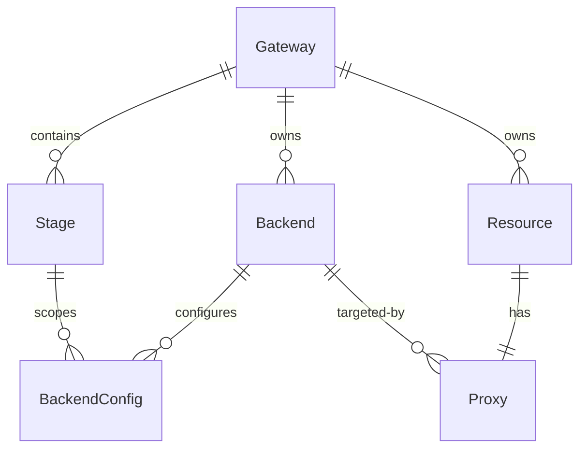
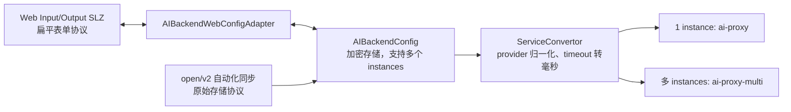

# AI Gateway 领域模型设计

> 状态：需求讨论稿。本文记录当前已确认的建模结论，后续讨论可继续补充。
>
> 主要实现范围：`src/dashboard`。第一期不增加模型请求的 AI 专用出站
> Header 限制。

## 1. 设计结论

AI Gateway 继续复用现有网关、环境、后端服务、资源和发布模型，通过不可变的 `kind` 字段区分业务类别。

- 新增 AI Gateway 网关类别。
- 模型服务不新增 `ModelBackend` / `ModelBackendConfig` 数据表，而是复用 `Backend` / `BackendConfig`。
- `Backend.kind` 区分普通后端服务和模型服务。
- `Resource.kind` 区分普通 API 和模型代理 API。
- `Proxy` 仍然只保留一个 `backend` 外键，不增加 `model_backend` 外键。
- `Backend.type` 和 `Proxy.type` 保持现有的协议语义，不用于区分普通服务和模型服务。
- Stage 插件绑定和同步写入不按 Backend.kind 限制；发布时普通 Service 保留全部 Stage 插件，模型 Service 由 controller 过滤不兼容插件并记录日志。Resource 插件仍在绑定或资源同步写入时按 Resource.kind 校验。
- 第一期不增加模型请求的 AI 专用出站 Header 限制；模型访问日志默认只记录统计摘要，不记录 Prompt 和模型回复正文。
- 模型代理 API 不能配置为 MCP Server 的工具资源，MCP Server 只允许关联 `Resource.kind=standard` 的 API。
- 模型代理 API 保留用户配置的外部 Resource.path，HTTP Method 固定为 POST；第一期只支持 Chat Completions。
- Chat Completions 默认同时支持普通响应和流式响应，不增加网关产品层的流式开关或额外限制。
- 模型 instance 可选配置固定模型；配置后由网关覆盖客户端请求中的 model，未配置时不覆盖。

## 2. 模型关系



### 2.1 Gateway

AI Gateway 与普通网关、可编程网关共用网关创建入口和 `Gateway` 模型，只通过网关类别区分。

约束：

- AI Gateway 创建后，网关类别不允许修改。
- AI Gateway 可同时拥有普通后端服务和模型服务。
- 普通网关和可编程网关不允许创建或同步模型服务、模型代理 API 等 AI 配置。
- 可编程网关仍然只能从页面创建，不作为自动化同步可创建的网关类别。

### 2.2 Backend

`Backend` 新增字符串类型、不可变的 `kind` 字段：

```text
Backend.kind = standard | ai
```

- `standard`：普通后端服务。
- `ai`：模型服务，只允许归属于 AI Gateway。

`Backend.type` 继续表示传输协议：

```text
Backend.type = http | grpc
```

模型服务的实际传输协议为 HTTP，因此当 `Backend.kind=ai` 时，`Backend.type` 固定为 `http`，不需要在模型服务产品接口中暴露该字段。

`Backend.kind` 创建后不能修改。不允许将已有普通后端服务转换为模型服务，反之亦然。

### 2.3 Backend 名称空间

`Backend` 继续保持 `(gateway, name)` 唯一约束。普通后端服务与模型服务共享名称空间，同一网关下不允许同名。

该约束使两类服务共享同一套全局唯一 ID 和名称，避免以下问题：

- APISIX Service ID 冲突。
- controller 中需要两套 Backend 到 Service 的映射。
- `bk-backend-context` 需要对 ID 和名称做运行时编码。
- 访问日志和 metrics 按后端名称过滤时混入另一类服务的数据。

相应的产品限制是：AI Gateway 自动创建普通 `default` Backend 后，不能再创建名为 `default` 的模型服务。

### 2.4 BackendConfig

`BackendConfig` 保持现有的环境维度和唯一约束：

```text
Gateway 1 --- N Backend
Backend 1 --- N BackendConfig
Stage   1 --- N BackendConfig

unique(gateway, backend, stage)
```

`BackendConfig.config` 的数据结构由 `Backend.kind` 决定，`config` 内不重复保存 `kind` 或 APISIX 插件类型。

普通 BackendConfig 继续使用现有结构：

```json
{
  "type": "node",
  "timeout": 30,
  "loadbalance": "roundrobin",
  "hosts": [
    {
      "scheme": "http",
      "host": "example.com",
      "weight": 100
    }
  ]
}
```

模型 BackendConfig 使用 `instances` 数组：

```json
{
  "timeout": 300,
  "instances": [
    {
      "name": "primary",
      "provider": "openai",
      "weight": 0,
      "auth": {
        "header": {
          "Authorization": "Bearer <secret>"
        }
      },
      "options": {
        "model": "gpt-4o",
        "temperature": 0.7
      }
    }
  ]
}
```

`instances[]` 以 [APISIX `ai-proxy-multi.instances`](https://apisix.apache.org/docs/apisix/plugins/ai-proxy-multi/) 的字段结构为基础，不增加 `ModelInstance` 数据表。dashboard 额外保存 `model_endpoint` 用于编辑和连接测试，controller 发布时移除该字段。

存储契约约束：

- 顶层只允许 `instances`、`timeout`、`balancer` 和 `fallback_strategy`，拒绝其他字段。
- `instances` 必须存在且至少包含一个实例；核心模型和发布转换支持多个实例。
- 第一期 Web API 和 open/v2 自动化同步 API 分别在自己的输入边界限制 `len(instances) == 1`。
- 每个 instance 的 `provider` 只允许 `openai`、`deepseek`、`openai-compatible`。
- `options` 和其中的 `model` 都可选；提供 `model` 时必须是非空字符串，其他合法 JSON 键值对完整保存。
- 单实例配置拒绝 `balancer` 和 `fallback_strategy`；多实例配置允许这两个 `ai-proxy-multi` 字段。

第一期 provider 允许列表由 dashboard 代码显式维护，不直接等同于 APISIX 当前支持的全部 provider。APISIX 后续新增 provider 或升级版本时不能自动进入产品 API，必须同步增加 Pydantic 类型、凭证处理和发布转换测试后才能开放。

第一期 instance 除 `options` 外使用显式最小字段集，Pydantic 类型拒绝未声明字段：

| 字段 | 约束 |
| --- | --- |
| `name` | 必填，非空字符串；作为未来开放多 instance 时的稳定标识 |
| `provider` | 必填，只允许第一期 provider 允许列表 |
| `weight` | 可选，未提供时默认 `0`；提供时必须是非负整数 |
| `auth.header` | 可选字符串 Header 映射；自动化协议允许多个 Header，Web 第一期只表示一个 Header |
| `options` | 可选 JSON 对象；`model` 可选，提供时必须为非空字符串；允许配置其他合法 JSON 键值对 |
| `override.endpoint` | 仅 `openai-compatible` 允许且必须提供 |
| `model_endpoint` | 可选；dashboard 编辑和连接测试使用，controller 发布时移除 |

`options` 的 key 必须是合法 JSON 字符串，value 可以是字符串、数字、布尔值、`null`、对象或数组。Pydantic `options` 类型允许额外字段；dashboard 必须完整保存，controller 必须原样透传，不能丢弃除 `model` 外的配置。

`openai` 和 `deepseek` 的 Chat Completions/Models endpoint 由 dashboard provider registry 维护，存储时不允许配置 `override`。发布时统一转换为 APISIX `openai-compatible` 并写入 registry 中的 `override.endpoint`，避免依赖 APISIX 内置 provider 的维护节奏。第一期不开放：

- `priority`。
- `checks`。
- `provider_conf`。
- `auth.query` 和 `auth.gcp`。

Model BackendConfig 顶层只开放 `timeout`：

- `timeout` 使用 dashboard 语义，单位为秒，必须是正整数。
- `timeout` 范围为 `1..300`，`AIBackendConfig` 在用户未提供时显式写入默认值 `300`。
- controller 发布时将 `timeout` 转换为 APISIX 使用的毫秒值。
- `ssl_verify` 固定为 `true`，不允许通过 Model BackendConfig 关闭。
- `keepalive`、`keepalive_timeout`、`keepalive_pool` 使用 APISIX 默认值，第一期不对用户开放。
- `logging` 不属于用户 BackendConfig，由 controller 固定生成 `summaries=true`、`payloads=false`。
- `balancer`、`fallback_strategy` 仅在多 instance 存储配置中允许，发布到 `ai-proxy-multi`。

#### 2.4.1 auth 凭证

`instances[].auth.header` 保持 APISIX 原生对象结构。AI Backend 的完整配置 JSON 复用 `DataPlane.etcd_configs` 的处理方式，共用 `apigateway.utils.crypto.get_crypto()` 的运行时算法和密钥配置。ORM 写入时先序列化并加密完整配置，在现有 JSONField 中保存为 `{"encrypted": "<ciphertext>"}`；`BackendConfig.config` 读取时解密并返回明文 JSON，可信内部代码始终使用该明文配置。普通 Backend（包括数据库中的存量记录）继续按原始 JSON 明文读写，不经过加解密。不增加独立凭证表或额外数据库列。

provider 约束：

- `openai`、`deepseek` 必须提供非空 `Authorization` Header。
- `openai-compatible` 允许空的 `auth.header`，也允许配置自定义 Header。
- Header key 按 HTTP 语义进行大小写不敏感的重复校验。

写入流程：

1. Web serializer 只校验扁平表单字段，`AIBackendWebConfigAdapter` 将其转换为单 instance 存储配置。
2. open/v2 自动化接口直接接收存储协议，并在各自接口边界限制一个 instance。
3. 两条路径都使用 `AIBackendConfig` 校验归一化结果后赋值给 `BackendConfig.config`。
4. `BackendConfig.config` 仅在 AI 配置的数据库写入边界加密完整 JSON；普通配置保持原样。

更新语义：

- 明文长度小于 4 时，掩码统一为 `****`；否则保留前 2 位和后 2 位，中间使用 `****`，例如 `sk****9z`。
- Web 更新 API 仅在 provider、目标地址和 Header 名称未改变，且请求 value 精确等于已有凭证的展示掩码时恢复数据库明文。
- provider、目标地址或 Header 名称变化后提交掩码值必须报错并要求重新输入凭证。
- 非掩码 value 保持请求原值；未提供的 Header 不从数据库补回，因为更新请求提交的是完整配置。
- 同步和其他非 Web 更新入口不解析掩码，输入值按完整明文配置处理。
- 显式提交空的 `auth.header` 表示清空全部 Header；仅 `openai-compatible` 允许保存空认证，`openai` 和 `deepseek` 应校验失败。

读取和使用约束：

- Web API 输出经 `AIBackendWebConfigAdapter` 转回与输入一致的扁平协议并输出掩码，不得输出明文、数据库密文或 `instances/auth/override` 等内部字段；审计事件使用同一转换结果。
- 第一阶段 Web DTO 只支持一个 `auth_header`；如果自动化写入了多个 Header，Web 查询或编辑必须明确报错，不能静默丢弃。未来可扩展 Web DTO 支持多个 Header，不改变存储协议。
- controller 从 `BackendConfig.config` 取得只存在于内存中的明文 auth，并注入生成的 `ai-proxy` 配置；ORM 解密失败必须终止发布。
- controller、发布记录、异常消息和日志不得序列化解密后的 auth。
- APISIX 运行配置最终需要包含可用凭证，因此 APISIX 与 etcd 属于凭证信任边界，必须依赖其访问控制和日志脱敏，不能把 dashboard 数据库加密误认为端到端加密。
- `BackendConfig` Django model 负责持久化边界的透明加解密，并提供显式的展示副本，不负责配置校验；所有接收外部配置的 view 和 biz 写入路径必须先通过 Pydantic 类型完成处理。Django Admin 与 controller 属于可信内部调用方，直接使用 `config` 明文；Web API 和审计输出统一使用 Web adapter 脱敏。

模型选择权属于 Model BackendConfig：

- 客户端 Chat Completions 请求可以省略 `model`，也可以为兼容 SDK 而携带该字段。
- 当 `instances[].options.model` 存在时，APISIX 使用该值覆盖客户端请求中的 model；未配置时不强制固定模型。
- 不允许客户端借用当前 Model Backend 的凭证选择其他模型。
- 可观测数据分别保留客户端请求模型和最终调用模型，不能把两者合并成一个字段。

未来 Web/自动化入口开放多实例时，只需放宽各自 API 边界并展示已经存在的多实例字段，不需要迁移存储结构或修改发布选择逻辑。

#### 2.4.2 Web、存储与发布协议



Web 输入和输出保持同一字段集合：`provider`、`endpoint`、`model_endpoint`、`api_key`、`auth_header`、`model`、`model_options`、`timeout`，backend 配置列表额外包含 `stage_id`。Web 不接收 `instances`、`auth`、`override`、`balancer`、`fallback_strategy` 等存储/APISIX 字段。

内置 provider 的 Web `endpoint`、`model_endpoint` 可省略；如果前端回传只读值，必须与 registry 完全一致。自定义 `openai-compatible` 必须提供完整 Chat Completions endpoint；`model_endpoint` 可选且只保存在 instance 内供编辑和连接测试使用。

连接测试只请求 Models API，选择顺序为：显式 `model_endpoint`、内置 registry、从以 `/chat/completions` 结尾的 endpoint 推导为 `/models`。推导后的请求失败时不尝试 Chat Completions，也不使用其他回退地址，直接提示用户显式配置 `model_endpoint`。

### 2.5 BackendConfig 配置校验

BackendConfig 配置由两个 Pydantic 类型统一定义和处理：

```text
StandardBackendConfig
    -> 普通后端的字段校验与 JSON 转换

AIBackendConfig
    -> 模型后端的字段校验与 JSON 转换
```

自动化 serializer 调用 Pydantic 类型完成输入校验和默认值归一化；Web serializer 先校验扁平 DTO，再由 adapter 转换并调用同一 Pydantic 类型。Pydantic 错误统一转换为 API 校验错误。AI 配置赋值给 `BackendConfig.config` 时自动加密完整 JSON，读取该属性时自动解密；普通配置原样读写。Web output serializer 和审计数据通过 adapter 输出扁平脱敏结果，controller 和 Django Admin 直接使用可信明文。

`Backend.kind` 与 Pydantic 类型的对应关系为：

```text
Backend.kind=standard
    -> StandardBackendConfig

Backend.kind=ai
    -> AIBackendConfig
```

两个 Pydantic 类型是“归一化后、准备入库的 `BackendConfig.config`”的权威契约。Web serializer、`/api/v2/sync`、内部服务和 controller 都必须以该契约为准。

类型定义与持久化转换分别位于：

```text
apigateway/core/backend_config.py -> Pydantic 类型与 JSON 转换
apigateway/core/models.py         -> BackendConfig.config 按 Backend.kind 持久化加解密；展示方法脱敏
apigateway/apis/web/ai_backend/  -> Web DTO、双向转换和掩码 Header value 恢复
apigateway/apis/backend_config.py -> 自动化输入使用的 Pydantic 错误转换和单实例边界
```

Pydantic 类型主要负责：

- 字段类型与必填字段。
- 数组长度与嵌套结构。
- 拒绝未声明字段，避免字段拼写错误被静默入库。
- 通过 Backend.kind 对应关系拒绝结构不匹配的配置。
- 核心配置允许多个 `instances`；第一期 Web 和自动化 API 在各自边界限制数量必须等于 1。

forbidden host、scheme 与 Backend.type 的关系等 API 上下文规则仍由 serializer 或业务 validator 负责；provider 与凭证规则由 Pydantic 类型直接校验。

外部配置入库前必须在显式边界处理：

- 自动化 API serializer 使用对应 Pydantic 类型校验并归一化输入。
- Web API serializer 只声明表单字段，adapter 转换后再使用 Pydantic 类型校验；掩码恢复同时校验 provider、目标 origin 和 Header 名称。
- biz 写入路径再次构造对应类型，不读取已有配置进行合并。
- 直接保存单个 BackendConfig 的 view 必须保存校验后的完整配置。
- Django model、manager 和 queryset 不承载配置校验规则；`config` property 只按 `self.backend.kind` 完成加解密，`_config` 映射已有数据库 `config` 列。管理命令、数据修复等可信内部调用如果直接写 ORM，仍应按输入可信度决定是否调用 Pydantic 类型。

需要通过契约测试覆盖 serializer 与 Pydantic 类型的组合路径，并直接测试两个 Pydantic 类型的结构校验、JSON 往返、Web 更新掩码恢复，以及 ORM 加解密边界。

## 3. Resource 与 Proxy

### 3.1 Resource.kind

`Resource` 新增字符串类型、不可变的 `kind` 字段：

```text
Resource.kind = standard | ai
```

- `standard`：普通 API。
- `ai`：模型代理 API（LLM API），只允许归属于 AI Gateway。

`Resource.kind` 需要显式存储，不从 Backend 临时推导，原因包括：

- 资源列表需要直接展示和过滤普通 API / 模型代理 API。
- 两类资源的创建、更新输入结构不同。
- 资源版本快照需要稳定记录历史资源类别。
- 导入导出和 controller Route 转换需要以资源类别为明确分支条件。

### 3.2 Resource 与 Backend 约束

`Proxy` 继续只通过现有 `backend` 外键关联 `Backend`。

```text
Resource.kind == Proxy.backend.kind
```

具体约束：

- `Resource.kind=standard` 必须关联 `Backend.kind=standard`。
- `Resource.kind=ai` 必须关联 `Backend.kind=ai`。
- Resource 和 Backend 必须归属于同一 Gateway。
- `Resource.kind` 创建后不允许修改。
- Web Resource 创建/更新，以及 `/apis/open`、`/apis/v2/sync` Resource 同步在写入 `Proxy.backend` 关系前校验两侧 kind 一致。
- 更新、导入或同步已有资源时，如果输入 kind 与存量记录不一致，应报错，不能静默修改资源类别。

### 3.3 Proxy.type 与 Proxy.config

`Proxy.type` 继续表示代理协议，两类资源均保持为 `http`，不增加 `llm` 或 `model` 类型。

- 普通 API 的 `Proxy.config` 继续保存普通后端请求方法、转发路径、子路径匹配和超时等配置。
- 模型代理 API 不使用普通后端路径改写配置，`Proxy.config` 为空对象，其 Proxy 仅负责关联模型 Backend。

模型代理 API 的入口协议：

- 外部 `Resource.path` 仍由用户配置，用于生成 APISIX Route 的匹配 URI，因此同一 Stage 下可以通过不同 path 暴露不同模型 Backend。
- `Resource.method` 固定为 `POST`，Web API、导入和 `/api/v2/sync` 不接受其他 Method。
- 第一阶段只支持 Chat Completions，不支持 Embeddings 或由客户端通过 URI 选择其他模型 API 类型。
- 客户端未开启流式时返回普通 Chat Completions 响应，开启流式时按模型协议返回 SSE；两种模式使用相同的 Resource 和 Model BackendConfig，不增加独立配置。
- 模型 Resource 不配置普通 Proxy 的转发 path、转发 method、match_subpath 或 route timeout；模型请求目标和 timeout 由 Model BackendConfig 负责。

## 4. 创建、更新与环境矩阵

### 4.1 Web 端

数据表复用不影响产品概念分离。Web API 可继续提供“后端服务”和“模型服务”两个入口与两套输入校验，但内部均读写 `Backend` / `BackendConfig`。

- 普通后端服务接口只查询 `Backend.kind=standard`。
- 模型服务接口只查询 `Backend.kind=ai`。
- 从 Web 创建 Backend 时，必须一次提交所有已有 Stage 的 BackendConfig，保持完整环境矩阵。

### 4.2 环境矩阵与发布完整性

BackendConfig 仍然是 Backend 在每个 Stage 下的配置。

- Web 创建或编辑流程保持完整矩阵。
- `/api/v2/sync` 按单个 Stage 同步，可以在同步过程中短暂形成不完整矩阵。
- 完整矩阵是发布就绪条件，而不是要求数据库任意时刻都满足的硬约束。
- 发布时，资源关联的 Backend 必须存在当前 Stage 的 BackendConfig，否则发布失败。

## 5. `/api/v2/sync` 同步协议

### 5.1 网关同步

网关同步输入新增字符串 `kind`：

```text
kind = normal | ai
```

兼容和约束：

- `kind` 缺省时默认为 `normal`，兼容存量自动化同步客户端。
- 自动化同步只允许创建普通网关或 AI Gateway，不允许创建可编程网关。
- 更新已有网关时，忽略请求中的 `kind`，不修改已有网关类别。
- 是否允许同步 AI 配置，以数据库中已存储的 Gateway kind 为准，不信任更新请求中的 `kind`。

### 5.2 Stage 同步

Stage 同步保留现有 `backends` 字段，并增加 `ai_backends`。

- `backends` 只同步 `Backend.kind=standard` 的 BackendConfig。
- `ai_backends` 只同步 `Backend.kind=ai` 的 BackendConfig。
- 只有 AI Gateway 允许传入 `ai_backends`。
- 模型 Backend 按 `(gateway, name)` 匹配或创建，并 upsert 当前 Stage 的 BackendConfig。
- 如果同名 Backend 已存在但 kind 不一致，同步失败，不修改存量 Backend.kind。
- 普通网关传入任何 `ai_backends` 配置时应报错，不能静默忽略。

同步采用增量 upsert 语义，不把 Stage 请求解释为 BackendConfig 的完整集合：

- 普通网关保持现有约束：`backends` 必填且至少包含一项，`ai_backends` 禁止传入。
- 创建 AI Gateway 的 Stage 时，`backends` 和 `ai_backends` 至少一个包含配置；允许只配置模型 Backend，不要求创建无实际用途的普通 BackendConfig。
- 更新 AI Gateway 的 Stage 时，未提供某个字段表示不修改该类 BackendConfig；提供非空数组时，仅 upsert 数组中列出的当前 Stage 配置。
- 更新时不允许用空数组表示删除；未列出的 Backend 和 BackendConfig 保持不变。删除不属于 Stage 同步协议的职责。
- 两个字段的处理应处于同一数据库事务中，任一配置校验或写入失败时整次 Stage 同步回滚。

## 6. Resource 导入、导出与同步

模型代理 Resource 与普通 Resource 使用相同的资源列表、导入导出和 `/api/v2/sync/gateways/{gateway_name}/resources/` 入口。

OpenAPI 导入导出在现有资源扩展对象中增加 `kind`：

```yaml
x-bk-apigateway-resource:
  kind: ai
  backend:
    name: model-service-name
```

字段值为 `standard | ai`。不增加独立的 `x-bk-apigateway-resource-kind` 扩展，也不使用重复语义的 `resourceKind`。

约束：

- 普通 Resource 导出时省略 `kind`，保持现有普通资源的导出内容不变；导入时未提供 `x-bk-apigateway-resource.kind` 则按 `standard` 处理。
- 普通 Resource 只允许引用普通 Backend。
- 模型 Resource 只允许引用模型 Backend。
- 模型 Resource 导出时必须显式写入 `kind: ai`，并且只导出关联模型 Backend 的名称，不导出 BackendConfig 中的 endpoint、auth、model 等环境配置。
- 导入模型 Resource 时，同名且 `kind=ai` 的 Backend 必须已存在当前 Gateway 下，否则导入失败。
- 更新已有 Resource 时，输入 kind 必须与存量 Resource.kind 一致。

### 6.1 MCP Server 资源限制

MCP Server 只允许使用普通 API 作为工具资源：

```text
MCPServer.resource_names -> Resource.kind=standard
```

`Resource.kind=ai` 的模型代理 API 不允许配置到 MCP Server。该限制是服务端领域约束，不能只依赖前端隐藏。

当前 MCP Server 按 `resource_names` 保存工具资源，并以 Stage 已发布的 ResourceVersion 判断资源是否有效。新增 Resource.kind 后，MCP 专用的有效资源集合必须同时满足：

- 资源存在于目标 Stage 当前使用的 ResourceVersion。
- 快照中的 `Resource.kind=standard`。
- 旧快照缺少 kind 时按 `standard` 处理。

不能直接修改通用的 `get_resource_names_set()` 使其全局排除模型资源，因为其他资源权限和发布流程仍可能需要处理模型 API。应增加 MCP 专用查询入口，或为底层快照查询增加显式 kind 条件，并由所有 MCP 路径复用。

约束需要覆盖以下入口：

- MCP Server 创建和更新时，候选 API 列表只返回普通 API。
- Web API 即使直接收到模型 API 的 resource_name，也必须返回校验错误，不能静默过滤后保存。
- `/api/v2/sync` 同步 MCP Server 时，`resource_name_to_schema` 或等价的有效资源映射只包含普通 API。
- 异步发布后保存 MCP Server 配置时再次校验，避免延迟任务或内部调用绕过入口 serializer。
- Stage 发布变更检查把模型 API 视为 MCP 不可用资源；脏数据中已关联的模型 API 应显示为需要移除的资源。
- MCP 工具列表和运行时工具加载再次过滤模型 API，保证历史脏数据不会被暴露为 MCP Tool。
- MCP Server 权限同步只为普通 API 创建 `AppResourcePermission`，不得为模型 API 创建虚拟 MCP 应用权限。

MCP 有效资源判断以 ResourceVersion 快照中的 kind 为准，而不是查询当前 Resource 表临时推导，确保 MCP Server 配置、Stage 发布版本和实际运行工具使用同一份资源定义。

## 7. 资源版本快照

ResourceVersion 快照需要保存 `Resource.kind`，并继续使用单一 Backend 引用：

```json
{
  "id": 1,
  "kind": "ai",
  "proxy": {
    "type": "http",
    "backend_id": 10,
    "config": "{}"
  }
}
```

兼容规则：

- 存量 Resource 和存量资源版本在迁移或读取时缺少 kind，均视为 `standard`。
- 快照不增加 `model_backend_id`，两类资源统一使用 `proxy.backend_id`。
- 发布时以快照 Resource.kind 决定 Route 转换逻辑，并信任写入阶段已经校验的 `Proxy.backend` 关系，不再重复校验 Resource/Backend kind。

## 8. Controller 发布转换

### 8.1 ReleaseData

`ReleaseData` 不应只返回 `backend_id -> config`，而应为 Service 转换提供包含 Backend 元数据的环境配置：

```text
StageBackendConfig
├── backend_id
├── backend_name
├── backend_kind
├── backend_type
└── config
```

### 8.2 ServiceConvertor

`ServiceConvertor` 负责编排，根据 Backend.kind 选择不同的 Service 构建逻辑：

```text
ServiceConvertor
├── StandardBackendServiceBuilder
│   ├── 构建普通 upstream
│   └── 普通 Service 插件集合
└── AIBackendServiceBuilder
    ├── 不构建普通 upstream
    ├── 构建 ai-proxy / ai-proxy-multi
    └── AI Service 插件集合
```

普通 Service 与模型 Service 的 stage 默认插件列表不强制相同。插件构建应采用以下结构，不能先构建普通 Service 插件列表再删除差异项：

```text
common stage plugins + standard-only plugins
common stage plugins + ai-only plugins + ai-proxy
```

`ai-proxy` / `ai-proxy-multi` 是当前模型 BackendConfig 的业务插件，不属于无条件的 stage 默认插件。

### 8.3 插件适用性与安全边界

模型 Service 不能在普通 Service 插件列表的基础上只增加 `ai-proxy`。`ai-proxy` 会绕过普通 NGINX upstream，通过 Lua HTTP 客户端直接访问模型服务，因此插件是否适用需要同时检查：

- 是否依赖 `upstream_*` 变量或普通 upstream 生命周期。
- 是否修改将被发送给模型服务的请求 Header。
- 是否会缓存、拼接或改写 SSE 流式响应。
- 是否会在日志中记录 Prompt、模型回复或模型凭证。

#### 8.3.1 Service 插件 Profile

Service 插件使用三组显式 Profile：

```text
common service plugins
+ standard-only service plugins

common service plugins
+ ai-only service plugins
```

第一期分类如下：

| 分类 | 插件 | 模型链路处理 |
| --- | --- | --- |
| 通用网关能力 | `bk-real-ip`、`bk-auth-validate`、`bk-auth-verify`、`bk-permission`、`bk-delete-sensitive`、`bk-delete-cookie`、`bk-stage-context`、`bk-resource-context`、`bk-backend-context`、`bk-debug`、租户校验、并发限制，以及 `bk-jwt`、`bk-break-recursive-call`、`bk-log-context`、`bk-error-wrapper` | 模型 Service 保留 |
| 通用可观测性 | `prometheus`、`bk-request-id`、`bk-response-check`、`file-logger` | 保留；模型 Service 使用安全日志 Profile |
| 模型 Service 专用 | controller 自动生成的 `ai-proxy` / `ai-proxy-multi` | 仅模型 Service 下发；按 instances 数量选择 |

具体约束：

- `bk-jwt`、`bk-break-recursive-call`、`bk-log-context` 和 `bk-error-wrapper` 在通用网关请求处理链中仍然有用，模型 Service 保留这些能力。
- `bk-error-wrapper` 在认证、权限、请求校验或限流插件提前终止请求后的 APISIX response filter 阶段执行，只包装 BlueKing 网关插件写入 `ctx.var.bk_apigw_error` 的错误。
- `ai-proxy` 和模型厂商错误不写入 `ctx.var.bk_apigw_error`，因此 `bk-error-wrapper` 保持其原始状态码、Header 和响应体不变。
- 第一期有意允许经过现有通用网关插件处理链后保留的所有内部 Header 和客户端请求 Header 进入 `ai-proxy` 的模型出站请求，本次实现不增加 AI 专用 Header 过滤。
- 模型 Service 的 `file-logger` 配置不得引用请求体、响应体、查询字符串、上游地址或模型厂商凭证。
- `bk-response-check` 继续提供现有网关、应用、Backend 和 Resource 维度的通用请求指标；LLM 模型、Token 和首 Token 延迟等指标由 APISIX Prometheus LLM metrics 提供。

模型 Service 中的 `ai-proxy` / `ai-proxy-multi` 只能由 controller 根据 BackendConfig 生成。Stage 可以保存同名插件绑定，但 controller 在模型 Service 转换时会将其过滤；模型 Resource 仍不允许绑定，避免用户配置覆盖由 BackendConfig 派生的模型配置。

#### 8.3.2 Stage 与 Resource 绑定插件

第一期对模型链路采用显式允许列表，普通链路保持现有行为：

| 策略 | 插件 | 说明 |
| --- | --- | --- |
| 允许用于普通和模型链路 | `bk-cors`、`bk-rate-limit`、`bk-ip-restriction`、`request-validation`、`bk-request-body-limit`、`bk-user-restriction`、`bk-access-token-source`、`bk-username-required`、OAuth2 认证插件、`uri-blocker`、`bk-header-rewrite`、`bk-query-string-rewrite`、`bk-traffic-label` | 处理入口认证、访问控制、请求校验或按已有通用规则改写请求 |
| 模型 Service 允许的 AI 专用能力 | `ai-prompt-decorator`、`ai-prompt-guard`、`ai-rate-limiting` | 依赖模型请求内容、`ai-proxy` 选中的 instance 或模型 Token usage |
| 模型链路禁止 | `bk-status-rewrite`、`api-breaker`、`response-rewrite`、`proxy-cache`、`bk-legacy-invalid-params` | 普通 upstream 状态对 AI driver 无效；响应改写和缓存可能破坏 SSE |
| 第一期不开放给模型链路 | `bk-mock`、`redirect`、`fault-injection` | 技术上可以短路请求，但会绕过模型调用或破坏模型响应契约；有明确产品场景后再开放 |

Stage 配置和同步入口只校验插件自身的 scope 与配置格式，不按该 Stage 当前的 Backend.kind 限制绑定。发布时由 Service 转换按 Backend.kind 处理：

- 普通 Backend 生成的 Service 保持现有行为，合并该 Stage 的全部绑定插件。
- 模型 Backend 生成的 Service 只合并显式允许列表中的 Stage 插件。
- 不在允许列表中的 Stage 插件会从模型 Service 配置中跳过，并按 gateway、stage 和插件类型记录 warning 日志；日志不得包含插件配置或模型凭证。
- 同一 Stage 同时包含普通和模型 Backend 时，两类 Service 各自按上述规则生成，不反向限制 Stage 的持久化配置。

Resource 绑定插件按 Resource.kind 校验。Web API 创建 Resource 插件绑定，以及 `/apis/open` 和 `/apis/v2/sync` 同步带插件的 Resource 时，模型 Resource 绑定不在允许列表中的插件会直接报错。

插件兼容策略由代码中的显式策略表维护。该策略表是模型 Service 发布转换和 Resource 写入校验的共同依据：Stage 入口不消费该策略，controller 在发布模型 Service 时过滤；Resource 的绑定和同步入口继续拒绝不兼容关系。前端不应按 Stage 当前 Backend 组合隐藏插件。

#### 8.3.3 模型请求出站 Header

第一期暂不增加模型请求的 AI 专用出站 Header 限制，不增加允许列表、拒绝列表或 AI driver 内部 Header 清理逻辑。

- 保持现有通用网关插件处理链；经过该链路后保留的客户端请求 Header 和内部 Header 均允许进入 `ai-proxy` 的模型出站请求。
- 保持 `ai-proxy` 当前 Header 转发行为；`Host` 和 `Content-Length` 仅沿用 driver 现有的传输层处理，不作为新增的安全过滤规则。
- BackendConfig 中 `instances[0].auth.header` 继续由 `ai-proxy` 按现有逻辑注入模型厂商凭证；controller 不新增普通请求 Header 的改写或过滤。
- 出站 Header 收敛不作为第一期发布前置条件，后续如需限制必须单独设计兼容策略并补充 APISIX driver 测试。

#### 8.3.4 模型日志

模型 Service 使用安全日志默认值：

```json
{
  "logging": {
    "summaries": true,
    "payloads": false
  }
}
```

- `summaries=true` 记录模型、Token 数量、首 Token 延迟和模型请求耗时等统计信息。
- `payloads=false` 不记录 Prompt、messages 和模型回复正文。
- 模型 Service 的 `file-logger` 复用全局 plugin metadata 的普通 API `log_format`，并额外增加 `llm_summary`；模型统计信息统一记录在 `llm_summary` 中，不重复展开为独立字段。
- 后续如开放 payload 日志，必须单独设计权限、脱敏、采样、保留期限和审计规则，不能通过普通插件配置直接开启。

### 8.4 ai-proxy 转换

controller 根据当前 BackendConfig 内 `instances` 的数量派生 APISIX 插件类型，数据库不存储插件类型。

```text
len(instances) == 1
    -> ai-proxy
    -> 将唯一 instance 的 provider/auth/options/override
       转换为 ai-proxy 的顶层配置
    -> options.model 存在时覆盖客户端请求中的 model

len(instances) > 1
    -> ai-proxy-multi
    -> 保留 instances 数组及多实例策略
```

第一期 Web 和自动化输入只允许一个 instance；核心存储与 controller 已支持多个 instance，内部可信配置可生成 `ai-proxy-multi`。
controller 发布时将内置 provider 归一化为 `openai-compatible` 并补充 registry endpoint，移除 `model_endpoint`，将 BackendConfig.timeout 从秒乘以 `1000` 转为插件毫秒值，并注入固定的 SSL 与日志安全配置。

### 8.5 APISIX Service

每个 `(Stage, Backend[kind=ai], BackendConfig)` 生成一个独立 APISIX Service。

- 普通 Service 保持现有 upstream。
- 模型 Service 不需要普通 upstream，由 `ai-proxy` 处理实际转发。
- controller 中 `Service.upstream` 需要允许缺省，序列化时不输出 `upstream: null`。
- Service ID 继续基于现有 Backend ID 生成。
- controller 继续只保留一套 `backend_id -> service_id` 映射。

#### APISIX version boundary

- An AI Gateway may bind and publish only when its `DataPlane.apisix_version` is `3.16` or later.
- Gateway creation and synchronization fail before persisting an incompatible binding; the dashboard transformer keeps the same defensive check before generating resources.
- APISIX 3.13 remains supported for standard gateways and receives no AI-specific changes.

### 8.6 bk-backend-context、日志与 metrics

普通 Service 和模型 Service 继续复用 `bk-backend-context`：

```text
bk_backend_id   = Backend.id
bk_backend_name = Backend.name
```

由于两类服务使用同一张 Backend 表且共享 `(gateway, name)` 唯一约束，无需使用负 ID、名称前缀或新增 APISIX 插件字段。现有 APISIX 侧逻辑无需修改。

### 8.7 Route 转换

模型代理 Resource 与普通 Resource 都生成 APISIX Route，并通过 `service_id` 关联 Service。

- `Resource.kind=standard`：保持现有普通 Route 转换逻辑和 `bk-proxy-rewrite`。
- `Resource.kind=ai`：使用用户配置的 Resource.path 和固定的 POST Method，关联模型 Service，不生成普通后端路径改写配置，并合并写入阶段已经校验的 Resource 插件绑定。

### 8.8 响应与错误契约

我们的插件报错统一由 `bk-error-wrapper` wrap；`ai-proxy` 以及模型服务返回的错误不 wrap，保持原始响应。

- 认证、权限、请求校验和网关限流等 BlueKing 网关插件错误写入 `ctx.var.bk_apigw_error`，由 `bk-error-wrapper` 转换为现有网关统一错误结构。
- `ai-proxy` 请求校验错误和模型服务返回的错误不写入 `ctx.var.bk_apigw_error`，保持其原始 HTTP 状态码、Header 和响应体。
- `bk-error-wrapper` 在 response filter 阶段执行，因此即使认证插件在 rewrite/access 阶段提前终止请求，仍能包装已经记录的网关插件错误。

## 9. 数据兼容与迁移

预期的数据模型变更：

- Gateway 增加 AI Gateway 类别。
- `Backend` 新增 `kind`，存量数据默认为 `standard`。
- `Resource` 新增 `kind`，存量数据默认为 `standard`。
- `BackendConfig` 不新增类型字段、新表或数据库列；AI 配置在现有 JSONField 中保存嵌套密文对象。
- `Proxy` 不新增模型 Backend 外键。
- `ResourceVersion` 快照格式增加 Resource.kind，旧快照缺省时按 `standard` 解释。

不创建以下数据表或关系：

- `ModelBackend`。
- `ModelBackendConfig`。
- `ModelInstance`。
- `Proxy.model_backend`。

## 10. 单表方案的查询约束

复用 Backend 表后，存量代码中所有没有 kind 条件的 Backend 查询都需要按语义分类：

- 只处理普通 Backend：显式过滤 `kind=standard`。
- 只处理模型 Backend：显式过滤 `kind=ai`。
- 确实处理所有 Backend：保留无 kind 过滤查询。

可以为 Backend QuerySet 提供显式的 `standard()` / `ai()` 方法降低遗漏风险，但不能让默认 manager 隐式过滤普通 Backend，否则 Stage 矩阵、发布和网关删除流程会遗漏模型 Backend。

## 11. 测试与验收

实现需要覆盖以下契约，不能只验证新增接口的成功路径：

- 数据迁移：存量 Backend 和 Resource 的 kind 均为 `standard`，旧 ResourceVersion 缺少 kind 时仍按普通资源发布。
- 不可变性：Gateway、Backend 和 Resource 创建后不能通过 Web API、导入或同步改变类别；Gateway 同步更新中的 kind 按约定忽略。
- BackendConfig：Pydantic 类型覆盖模型 provider、多 instance、可选 model/options、多实例策略、endpoint、timeout 和未知字段约束；Web/自动化边界分别覆盖第一期单实例限制。
- 凭证：AI 配置经 view/biz 写入后数据库只保存完整配置 JSON 的嵌套密文，且与 `DataPlane.etcd_configs` 使用相同的 `get_crypto()` 入口和运行时算法、密钥配置；普通配置及其存量记录保持原始 JSON 明文。ORM 读取与 Django Admin 返回可信明文，Web API 与审计在明文长度小于 4 时返回 `****`，否则保留前后各 2 位；Web 更新 API 对掩码 value 的恢复、非掩码替换、清空和解密失败路径均有覆盖。
- Stage 同步：普通网关拒绝 `ai_backends`；AI Gateway 支持纯模型 Stage、双字段事务 upsert、缺省不修改、空数组不删除和同名不同 kind 冲突。
- Resource：Web 创建/更新和 `/apis/open`、`/apis/v2/sync` 同步均拒绝 kind 与 Backend.kind 不一致的关系；模型资源固定 POST、Proxy.config 为空；导入导出遵循 `x-bk-apigateway-resource.kind` 的兼容规则。
- 插件兼容性：Web Stage 绑定和 Stage 同步不按 Backend.kind 限制；普通 Service 保留全部 Stage 插件，模型 Service 发布时过滤不兼容 Stage 插件并记录不含配置或凭证的日志；Web Resource 绑定和 `/apis/open`、`/apis/v2/sync` Resource 插件同步仍拒绝不兼容关系。
- MCP Server：候选列表、创建更新、自动化同步、异步发布、运行时工具加载和权限同步均排除模型 Resource，且按 ResourceVersion 快照判断。
- controller：普通 Backend 的 Service/Route 输出保持不变；模型 Backend 按实例数量生成 `ai-proxy` 或 `ai-proxy-multi`，内置 provider 发布为 `openai-compatible`，只在发布时将 timeout 转为毫秒，并生成无 upstream 的 Service、安全插件 Profile 和关联 service_id 的 Route。
- data plane：AI Gateway 仅允许绑定 APISIX 3.16 及以上版本的数据面，创建和同步在持久化绑定前失败；controller 在生成资源前保留同一规则的防御性检查。普通网关继续支持 APISIX 3.13，且不包含 AI 专用变更。
- 请求链路：普通响应和 SSE 流式响应均可用；BlueKing 网关插件错误由 `bk-error-wrapper` 统一包装，`ai-proxy` 和模型服务错误保持原始响应；第一期不增加 AI 专用出站 Header 过滤。
- 回归：普通网关、可编程网关以及 AI Gateway 中的普通 Backend/Resource 沿用现有行为。

## 12. 非第一期范围

以下内容不阻塞第一期实现，后续开放前需要重新设计并确认：

- Web 和自动化 API 对多实例配置、负载均衡、重试、故障转移和健康检查的产品形态。
