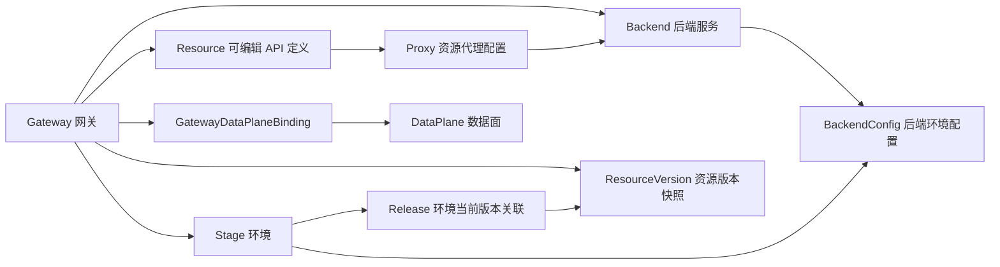
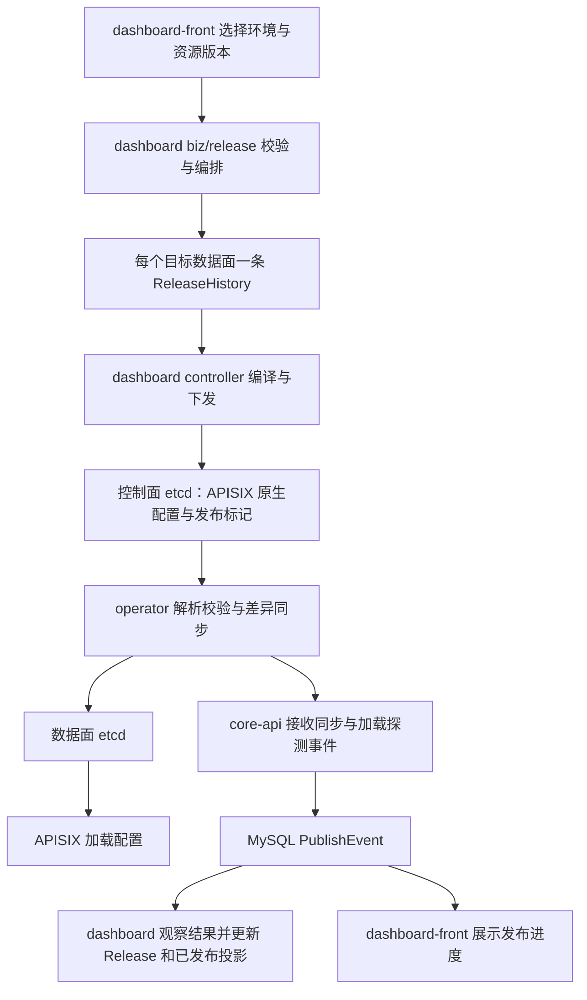

# BlueKing API Gateway DDD 统一概念词汇

本文是整个仓库的统一语言（Ubiquitous Language）入口。以 `src/dashboard` 控制面的领域定义为主，
说明 operator、core-api、dashboard-front、mcp-proxy 如何使用和映射这些概念。
所有组件的 agent 开始工作时均应阅读本文；新代码、接口设计、页面文案、测试和评审使用这里的概念。

本次梳理基于上游 `master` 的 `502279760`。表中的源码链接是核对入口；维护时以目标分支的模型、
业务流程及消费者契约核实实际行为，并同步更新本文。历史数据库列、协议字段和枚举值仍按兼容契约保留。

## 1. 阅读与命名约定

- 首次出现时使用“中文名（English / 代码名）”，后续保持同一术语；例如“资源版本（Resource Version）”。
- `Gateway` 表示网关，`Resource` 表示网关内的 API 定义。“API”描述接口时必须明确是否指 Resource；
  不能根据历史 `api_id` 把 Gateway 误认成单个接口。
- 描述对象时注明所属网关、环境、版本或数据面；描述 ID 时使用具体字段名，避免笼统的“版本 ID”“发布 ID”。
- 同一业务概念在边界处可以有不同表示，但必须记录映射。例如 Resource 编译为 APISIX Route，
  不是让两者共享一个未经限定的“资源”定义。
- 本文梳理现有模型与职责，不要求把 ORM 模型机械改造成 DDD 类，也不授权修改既有接口或存量数据。

### DDD 术语在本仓库中的含义

| 术语 | 使用约定 |
| --- | --- |
| 统一语言 / Ubiquitous Language | 业务、控制面、运行组件和前端共同理解的词汇及其身份、关系、生命周期约束。 |
| 限界上下文 / Bounded Context | 对概念和规则负责的语义边界。下节按现有职责划分逻辑上下文，不声明它们已是独立部署或独立数据库。 |
| 实体 / Entity | 具有持续身份的领域对象，如 Gateway、Resource、Stage；名称、配置或状态变化不等于创建新身份。 |
| 值对象 / Value Object | 用内容表达配置或规则的值，如标准/AI 后端配置的规范化结构；不能因为 JSON 存在某张表中就推导出独立实体。 |
| 聚合 / Aggregate | 维护一致性规则的业务边界。网关是许多对象的归属边界，但整个 Gateway 关系图并不因此成为一次事务必须加载和保存的聚合。具体事务边界由拥有该用例的 `biz/` 流程决定。 |
| 领域事件 / Domain Event | 描述已经发生的业务事实。现有 PublishEvent 是发布过程的持久化事件；不能推导出所有领域都已有事件总线、事件溯源或统一事件模型。 |
| 边界适配 / Context Mapping | 把一个上下文的概念转换为另一个上下文的表示。dashboard controller 的 APISIX 编译、core-api 的表映射、MCP 工具转换都需要显式映射。 |

## 2. 上下文与组件职责

| 逻辑上下文 | 主要拥有者 | 负责的概念与边界 |
| --- | --- | --- |
| 网关定义与配置 | dashboard `core/`、`biz/gateway`、`biz/resource`、`biz/stage`、`biz/backend` | 定义 Gateway、Stage、Resource、Proxy、Backend、BackendConfig、Context 及写入规则。 |
| 版本与发布 | dashboard `biz/resource_version`、`biz/release`、`controller/` | 制作快照，编排发布，编译 APISIX 配置，选择目标数据面并下发，记录发布过程。 |
| 运行配置同步 | operator | watch 控制面 etcd 中的 APISIX 原生配置，解析/校验、合并调度、差异同步到数据面 etcd，探测加载结果并上报。当前不负责从 dashboard ORM 模型编译 APISIX 配置。 |
| 应用调用授权 | dashboard `apps/permission`、`biz/permission`；core-api 提供运行时查询 | dashboard 管理权限申请和授权数据；core-api 查询、缓存应用调用权限，并按已发布版本解析资源名称。运行时请求执行由 APISIX 及插件负责。 |
| 管理访问控制 | dashboard `apps/rbac`、`biz/iam` | 管理用户在网关上的成员角色和操作权限及 IAM 授权协作；与应用调用 API 的授权区分。 |
| 发布事件接收 | core-api | 接收 operator 发布事件，关联 ReleaseHistory，去重并写入 dashboard 使用的发布事件表；不发起版本发布。 |
| MCP 服务定义 | dashboard `apps/mcp_server`、`biz/mcp_server` | 定义 MCP Server、所选工具资源、工具别名、协议、扩展和应用权限。 |
| MCP 协议代理 | mcp-proxy | 读取服务定义及环境当前版本的 OpenAPI 制品，生成工具、管理协议实例、检查服务访问权限，并经网关调用 API。 |
| 产品交互 | dashboard-front | 使用控制面 API 展示与编辑上述概念，保留接口 DTO 映射；页面分类、store 名称和路由不重新定义领域对象。 |
| 数据面执行 | APISIX / `blueking-apigateway-apisix`（独立仓库） | 加载运行配置，执行匹配、认证、鉴权、插件和转发。本文只描述本仓库可核对的配置及调用边界。 |

dashboard 内的分层职责仍遵循 [dashboard 指南](../src/dashboard/AGENTS.md)：
`apis -> biz -> controller -> service -> components -> apps -> core -> common -> utils`。
上下文划分不改变 import-linter 契约，也不把各层都称为“领域服务”。

## 3. 控制面核心词汇

以下实体以 [core/models.py](../src/dashboard/apigateway/apigateway/core/models.py)
及 [core/constants.py](../src/dashboard/apigateway/apigateway/core/constants.py) 为核对入口。

| 中文名 / English | 代码名与身份范围 | 定义及约束 |
| --- | --- | --- |
| 网关 / Gateway | `Gateway`；`id`；`name` 全局唯一 | 一组 API 的管理与发布归属。拥有环境、资源、后端等；不是 APISIX 进程或单个 HTTP 接口。 |
| 网关类别 / Gateway Kind | `Gateway.kind` | `normal`、`programmable`、`ai` 的领域分类；ORM 分别存数值 `0`、`1`、`2`，边界按枚举转换。与认证配置中的网关类型、后端传输 `type` 区分。 |
| 网关弃用 / Gateway Deprecation | `Gateway.is_deprecated`、`deprecated_note` | 标记网关进入弃用生命周期并说明原因；与启停状态、是否公开、是否官方和删除分别表达。 |
| 环境 / Stage | `Stage`；`id`；`(gateway, name)` 唯一 | 网关内的发布目标环境，如 `prod`、`test`，带有变量、状态和环境配置。产品统一称“环境”；不是 DataPlane 或部署实例。 |
| 环境变量 / Stage Variable | `Stage.vars` 内的键值 | 环境级参数，用于受支持的路径或配置渲染。与进程环境变量、配置文件里的运行参数区分；是否允许引用变量由具体配置契约决定。 |
| 资源 / Resource | `Resource`；`id`；归属 Gateway | 一条可编辑的 API 定义，含资源名称、请求方法、路径、类别和代理关联。归属网关，不直接归属 Stage；环境运行哪份定义由版本与 Release 决定。 |
| 资源名称 / Resource Name | `Resource.name`；在网关内校验唯一 | API 的业务标识，用于已发布快照查找、OpenAPI/MCP 映射等；与 `METHOD path` 请求匹配标识、资源主键和工具别名区分。写入边界还校验 `(gateway, method, path)`，不能误称这两项都是 ORM 数据库唯一约束。 |
| 资源类别 / Resource Kind | `Resource.kind` | `standard` 或 `ai`。模型代理 API 仍是 Resource；缺少 kind 的历史快照按 `standard` 解释。 |
| 资源代理配置 / Resource Proxy | `Proxy`；`(resource, type)` 唯一 | 资源如何连接后端的配置；`Resource.proxy_id` 选择其使用的代理，`Proxy.backend` 引用 Backend。与 mcp-proxy 服务和 APISIX `ai-proxy` 插件区分。 |
| 后端服务 / Backend | `Backend`；`id`；`(gateway, name)` 唯一 | 网关内可复用的后端身份。资源经 Proxy 引用它；地址、超时等环境差异放在 BackendConfig。不是 APISIX Service，也不是 dashboard 的 `service/` 代码层。 |
| 后端类别 / Backend Kind | `Backend.kind` | `standard` 或 `ai`；业务类别与 `Backend.type` 传输类型区分。普通 API/模型代理 API 分别关联相应类别的后端。 |
| 后端环境配置 / Backend Configuration | `BackendConfig`；`(gateway, backend, stage)` 唯一 | 某后端在某环境下的具体配置。普通配置包含 hosts、timeout、loadbalance 等；AI 配置包含 provider/instances 等，使用规范化存储结构。 |
| 作用域配置 / Context | `Context`；`(scope_type, scope_id, type)` 唯一 | 网关、环境或资源的类型化配置，如网关认证、资源认证；由 schema 校验。不是 Go `context.Context`、请求上下文或 DDD 限界上下文。 |
| 环境资源禁用 / Stage Resource Disabled | `StageResourceDisabled`；`(stage, resource)` 唯一 | 表达某资源在指定环境不可用；相关环境名称进入资源版本快照，不改变 Resource 的网关归属。 |
| 数据面 / Data Plane | `DataPlane`；`id`；`name` 唯一 | 一个有独立 etcd 配置、命名空间、访问地址模板与 APISIX 版本的发布目标。与同一网关的 Stage 是不同维度。 |
| 网关数据面绑定 / Gateway–Data Plane Binding | `GatewayDataPlaneBinding` | 表达网关可以向哪些数据面发布；一个网关可绑定多个数据面。当前版本发布遍历其绑定的活跃数据面。 |
| 租户 / Tenant | `Gateway.tenant_mode`、`tenant_id`；调用者租户信息 | `single` 与 `global` 表达网关的租户模式，影响访问和隔离规则。租户不等于网关、蓝鲸应用或环境，也不能替代各自的授权检查。 |

配置形状与校验分别见 [backend_config.py](../src/dashboard/apigateway/apigateway/core/backend_config.py)、
[DataPlane 模型](../src/dashboard/apigateway/apigateway/apps/data_plane/models.py) 和
[租户规则](../src/dashboard/apigateway/apigateway/common/tenant/validators.py)。

### 归属关系

图中的箭头表达归属或引用，不表示对象创建顺序、事务边界或所有权级联删除。
尤其不能把 `Gateway -> Stage -> Resource` 当成 ORM 归属链。

## 4. 版本、发布与运行态

| 中文名 / English | 代码名 | 定义及容易混淆的边界 |
| --- | --- | --- |
| 资源版本 / Resource Version | `ResourceVersion` | 网关资源定义的快照集合，包含资源、代理、资源 Context、资源插件、禁用环境等快照信息。它可以发布到多个环境；不是某一次发布尝试。 |
| 版本号 / Version Label | `ResourceVersion.version` | 展示或选择版本的字符串，创建时在网关内校验唯一；与数据库 `ResourceVersion.id`、快照格式 `schema_version` 和 APISIX 软件版本区分。 |
| 环境当前版本关联 / Release | `Release` | 每个 Stage 至多一条关联记录，引用一个 ResourceVersion。`Release.id` 是关联记录主键，不是每次发布的流水号。 |
| 已发布资源投影 / Released Resource | `ReleasedResource` | 按 `(gateway, resource_version_id, resource_id)` 保存的查询投影，来源于已发布快照。不是另一份可编辑 Resource，也不单独表示某个数据面已加载。 |
| 发布历史 / Release History | `ReleaseHistory` | 记录一次面向环境和数据面的发布过程，含 source、资源版本与目标数据面；正常版本发布对每个目标数据面建立独立记录。历史 data_plane 可为空。 |
| 发布事件 / Publish Event | `PublishEvent` | 一次发布过程的步骤、状态与详情；`publish` 外键指向 ReleaseHistory，持久化列为 `publish_id`。与操作审计、请求日志区分。 |
| 发布输入 / Release Data | `controller.ReleaseData` | 编译时结合资源版本快照与当前网关/环境配置、BackendConfig、环境插件等得到的输入；不是完整配置均冻结的 ResourceVersion。 |
| 发布标记 / Release Marker | `controller.BkRelease`；etcd `_bk_release`；operator `ReleaseInfo` | 携带环境发布信息和 publish_id 的同步标记，不是 ORM Release 或 ReleaseHistory 的另一张表。 |
| APISIX 路由 / APISIX Route | controller/operator `Route` | 由资源快照编译出的运行时匹配、插件与 Service 引用配置。ID、运行地址和附加路由由编译规则决定，不能直接视为 Resource.id。 |
| APISIX 服务 / APISIX Service | controller/operator `Service` | 后端在环境中的运行配置表示，承载 upstream/插件等。可由同后端的多个路由引用；与 Backend 身份区分。 |
| 上游 / Upstream | APISIX upstream 配置 | 普通后端实际转发目标及负载均衡配置。AI Service 由模型代理插件发起调用，可没有普通 upstream。 |
| 插件元数据 / Plugin Metadata | APISIX `plugin_metadata` | 运行时插件的全局配置；operator 将其作为全局资源同步，不能当作某个 Stage 的 PluginBinding。 |

核对入口：[制作资源快照](../src/dashboard/apigateway/apigateway/biz/resource_version/resource_version.py)、
[ReleaseData](../src/dashboard/apigateway/apigateway/controller/release_data.py)、
[APISIX 转换](../src/dashboard/apigateway/apigateway/controller/transformer.py)、
[发布标记转换](../src/dashboard/apigateway/apigateway/controller/convertor/bk_release.py)。

修改当前 Resource、Proxy 或资源插件不会自动改写已经生成的资源版本定义。
但发布同一个 ResourceVersion 时读取的环境、BackendConfig 等配置可以变化，所以“资源版本相同”
不保证编译出的完整运行配置相同。需要分析变更或回滚时同时明确快照与当前配置。

### 发布动作与状态

1. **生成资源版本 / Create Resource Version**：从可编辑定义制作快照；保存版本不表示环境已经运行该版本。
2. **版本发布 / Publish Resource Version**：选定 ResourceVersion 与 Stage，校验并对各活跃绑定数据面创建
   ReleaseHistory，编译、下发配置，再观察发布事件。
3. **配置重新下发 / Republish Configuration**：后端、环境、插件等配置变化可触发重新编译已有 Release
   引用的资源版本；不必生成新的 ResourceVersion。具体触发范围由对应业务流程决定。
4. **环境下架 / Disable Stage**：停止该环境的运行配置；与删除 Stage、删除资源和删除版本是不同动作。
5. **删除 / Delete**：明确被删除的对象和持久化/运行态清理流程，不能用“下架”概括所有删除行为。

标准版本发布链路：

发布步骤依次为配置校验、生成任务、下发配置、解析配置、应用配置、加载配置。
前三步由 dashboard 流程产生；operator 报告解析、应用以及 APISIX 加载探测结果，core-api 接收并落库。
`distribute_configuration` 或 `apply_configuration` 成功都不等于最终发布成功。
“发布失败”也可能表示事件缺失或超时导致结果无法确认，不必然表示数据面没有应用配置。

发布事件状态使用 `pending`、`doing`、`success`、`failure`；发布历史的展示状态由最新事件和超时规则推导。
Gateway/Stage 的 `ACTIVE=1`、`INACTIVE=0` 是启停状态，不能用它们替代某次发布状态。
发布来源（`ReleaseHistory.source` / `PublishSourceEnum`）说明版本发布、后端更新、插件变更等触发原因，
与发布步骤、状态以及资源版本的类别分别表达。

当前 `Release` 没有数据面维度：首次发布会预先创建关联，已有关联在发布成功后的回调中更新；
某一个数据面成功即可触发更新，不能据此认定所有绑定数据面已加载相同版本。
需要判断单个数据面结果时检查对应 `ReleaseHistory`、事件与运行态，而不是仅检查 `Release` 或 Stage.status。
MySQL、两个 etcd 及 APISIX 加载之间是异步传播，不能推导出跨组件的原子提交或即时一致性。

核对入口：[版本发布编排](../src/dashboard/apigateway/apigateway/biz/release/gateway_releaser.py)、
[配置重新下发](../src/dashboard/apigateway/apigateway/controller/publisher/publish.py)、
[成功回调](../src/dashboard/apigateway/apigateway/controller/tasks/release.py)、
[operator 提交与同步](../src/operator/pkg/core/committer/committer.go)、
[加载探测上报](../src/operator/pkg/eventreporter/reporter.go)、
[发布历史状态](../src/dashboard/apigateway/apigateway/core/models.py)。

## 5. 认证、权限与管理角色

| 中文名 / English | 代码名或字段 | 统一含义 |
| --- | --- | --- |
| 蓝鲸应用 / BlueKing Application | `bk_app_code` | 调用 API 或 MCP Server 的应用身份；不是用户 username、网关 ID 或后端服务名。 |
| 认证 / Authentication | 网关/资源认证 Context、JWT、OAuth2 等边界协议 | 验证应用或用户身份。身份已认证不等于获得管理权限、资源调用权限或 MCP 服务访问权限。 |
| 网关成员 / Gateway Member | `GatewayMember`；`(gateway, username)` 唯一 | 控制面管理主体及角色，当前角色包含管理员 `administrator`、运营者 `operator`。role=operator 与 operator 运行组件无关。 |
| 网关操作权限 / Gateway Action Permission | `GatewayActionEnum`、`GATEWAY_ROLE_ACTIONS` | 允许用户管理、运营网关或审批权限等操作。不要再仅根据历史 maintainers 字段推导当前管理授权。 |
| 应用网关调用权限 / App Gateway Permission | `AppGatewayPermission`；`(bk_app_code, gateway)` | 应用访问网关所有资源的授权，含有效期；不是该应用获得网关管理员角色。 |
| 应用资源调用权限 / App Resource Permission | `AppResourcePermission`；`(bk_app_code, gateway, resource_id)` | 应用对特定资源的调用授权，含有效期。resource_id 故意不是当前 Resource 的级联外键，以兼容草稿已删除、发布快照仍存在的资源。 |
| 权限申请 / Permission Application | `AppPermissionApply`、`AppPermissionRecord` | 申请与处理记录，含审批状态、授权维度等；申请单存在或审批流程开始不等于有效授权已经存在。 |
| 运行时权限查询 / Runtime Permission Query | core-api `AppPermissionService.Query` | 查询应用网关/资源权限；资源名称通过 Stage 的 Release 和 ResourceVersion 映射到 resource_id，不能改成只查当前可编辑 Resource。 |
| MCP 服务应用权限 / MCP Server App Permission | `MCPServerAppPermission`；`(bk_app_code, mcp_server)` | 应用访问特定 MCP Server 的授权；不与 AppResourcePermission 合并成一个对象。 |
| OAuth2 内置应用 / OAuth2 Built-in Application | `public`、`personal` 应用及对应 enabled 字段 | 公开/个人客户端模式使用的内置应用授权，由发布和权限协调流程维护；不等于 `is_public` 自动提供匿名访问。 |
| 公开可见 / Public Visibility | 各对象的 `is_public` | 对应对象的展示/公开范围属性。Gateway、Stage、Resource、MCPServer 上的具体策略需按所属流程判断，不能统一解释为免认证或免授权。 |

权限写入由 dashboard 拥有；core-api 的 DAO/缓存是对同一领域数据的运行时访问表示，缓存值可能滞后。
权限通常不以 Stage 为授权键，但运行时通过 Stage 选择资源快照；不要新增“环境级资源授权”含义来解释查询参数。
MCP 调用使用 `v_mcp_{mcp_server_id}_{app_code}` 虚拟应用身份向网关调用工具 API，
其 AppResourcePermission 由 dashboard 的 MCP 权限流程同步；服务访问许可和工具 API 调用许可是两个检查边界。

核对入口：[应用调用权限模型](../src/dashboard/apigateway/apigateway/apps/permission/models.py)、
[RBAC 模型](../src/dashboard/apigateway/apigateway/apps/rbac/models.py)、
[角色与动作](../src/dashboard/apigateway/apigateway/apps/rbac/constants.py)、
[core-api 权限查询](../src/core-api/pkg/service/app_permission.go)、
[OAuth2 发布权限协调](../src/dashboard/apigateway/apigateway/controller/tasks/oauth2_builtin.py)、
[MCP 权限同步](../src/dashboard/apigateway/apigateway/biz/mcp_server/mcp_server.py)。

## 6. 插件、接口协议与 MCP

| 中文名 / English | 代码名 | 统一含义 |
| --- | --- | --- |
| 插件类型 / Plugin Type | `PluginType`；`code` | 可用插件的类型定义、适用作用域和配置 schema；code 对应 APISIX 插件名，不等于配置实例。 |
| 插件配置 / Plugin Configuration | `PluginConfig` | 网关内某插件类型的一份配置；与 APISIX 原生插件配置表示及 PluginMetadata 区分。 |
| 插件绑定 / Plugin Binding | `PluginBinding`；scope_type、scope_id、config | 将插件配置应用到环境或资源。资源绑定随资源版本快照参与发布，环境绑定在发布时读取。是否可绑定及如何合并由作用域和类别规则决定。 |
| 资源接口协议 / Resource OpenAPI Schema | `OpenAPIResourceSchema` | 可编辑资源的请求/响应协议结构；不是 Context/PluginType 的配置校验 Schema，也不是文本资源文档。 |
| 接口协议版本 / OpenAPI Schema Version | `OpenAPIResourceSchemaVersion` | 与 ResourceVersion 关联的接口协议快照。 |
| 版本 OpenAPI 制品 / Versioned OpenAPI Specification | `OpenAPIFileResourceSchemaVersion`；`openapi_gateway_resource_version_spec` | 与资源版本关联的完整 OpenAPI 文件制品，供 MCP 等消费者读取；不要仅凭表名当作另一种资源版本。 |
| 资源文档 / Resource Documentation | `ResourceDoc`、`ResourceDocVersion`、`ReleasedResourceDoc` | API 使用说明及其版本/已发布投影；与可机器解析的 OpenAPI 协议分别维护。 |
| 网关 SDK / Gateway SDK | `GatewaySDK` | 为调用 API 生成和分发的语言 SDK 制品，可关联资源版本；SDK 包版本不是 publish_id 或 APISIX 版本。 |
| 操作审计事件 / Audit Event | `AuditEventLog` | 记录谁对什么对象进行了何种操作及前后数据；与发布步骤事件、API 访问日志和分布式 trace 分别表达。 |
| MCP 服务 / MCP Server | `MCPServer`；name 全局唯一，引用 gateway 和 stage | 将选定环境的 API 暴露为 MCP 工具的服务定义。服务本身不绑定独立 ResourceVersion，运行时跟随该 Stage 的 Release。 |
| MCP 工具 / MCP Tool | resource_names、tool_names；运行时工具定义 | 已发布普通 API 在 MCP 协议中的映射，不是新建 Resource。`resource_name@tool_name` 表示工具别名；无别名时工具名使用资源名。 |
| MCP 提示模板 / MCP Prompt | `MCPServerExtend(type=prompts)` | 服务扩展中的提示模板；与 MCP 工具、模型后端 provider 以及 API 的请求体区分。 |
| MCP 协议类型 / MCP Protocol Type | `protocol_type` | SSE 与 Streamable HTTP 的协议选择；与 Backend.type、Resource.kind 区分。 |
| MCP 原始响应模式 / Raw Response Mode | `raw_response_enabled` | 控制工具结果是否返回原始 API 响应体；不改变资源身份、授权归属或版本选择。 |

MCP 工具选择以目标 Stage 已发布 ResourceVersion 中的普通资源为准：`kind=standard`，
历史快照缺少 kind 时按普通资源处理。模型代理 API（`kind=ai`）不能作为 MCP 工具资源。
mcp-proxy 将版本 OpenAPI 的 operation 映射为工具，并按原资源名选择、按别名暴露，
随后经网关调用 API；它不直接代替 Backend 或 APISIX 的资源执行流程。
工具别名变化不改变资源 ID，不应导致把原资源权限改授给同名的其他资源。

核对入口：[插件模型](../src/dashboard/apigateway/apigateway/apps/plugin/models.py)、
[OpenAPI 模型](../src/dashboard/apigateway/apigateway/apps/openapi/models.py)、
[文档与 SDK 模型](../src/dashboard/apigateway/apigateway/apps/support/models.py)、
[操作审计模型](../src/dashboard/apigateway/apigateway/apps/audit/models.py)、
[MCP 模型](../src/dashboard/apigateway/apigateway/apps/mcp_server/models.py)、
[MCP 有效资源与权限](../src/dashboard/apigateway/apigateway/biz/mcp_server/mcp_server.py)、
[mcp-proxy 加载](../src/mcp-proxy/pkg/mcp/mcp.go)、
[OpenAPI 工具转换](../src/mcp-proxy/pkg/infra/proxy/converter.go)。

### AI 后端词汇与表示边界

“模型服务 / AI Backend”是 `Backend(kind=ai)` 的产品名称；“模型代理 API / AI Resource”是
`Resource(kind=ai)`，两者复用现有 Backend、BackendConfig、Resource、Proxy 关系。
普通 Backend/Resource 也可以存在于 AI Gateway 中，不能根据 Gateway.kind 代替子对象 kind 判断。

| 概念 | 所属表示 | 约定 |
| --- | --- | --- |
| 模型厂商 / Provider | 规范化 AIBackendConfig | 表达厂商产品身份，例如 openai、deepseek；与 APISIX 发布后的 `openai-compatible` 适配值区分。 |
| 模型实例配置 / AI Backend Instance | AIBackendConfig.instances | 一份 provider、auth、options、override 等配置；不是独立 ModelInstance 数据库实体，也不是 operator/APISIX 进程实例。 |
| 模型名 / Model Name | instance options.model 等模型调用配置 | 模型厂商的模型标识；不是 Backend.name、Resource.name 或 MCP tool_name。 |
| Web 配置 / Web DTO | `AIBackendWebConfigAdapter` | 前端输入输出表示，在 API 边界适配到规范化结构；字段布局、掩码和输入限制不直接成为核心存储定义。 |
| 规范化存储配置 / Stored Configuration | `core.backend_config.AIBackendConfig` 与 BackendConfig ORM | 类型化存储契约；AI BackendConfig 在 ORM 持久化边界加密。不能以页面 DTO 或 APISIX 插件结构绕过该边界写入。 |
| 运行插件配置 / Published Plugin Configuration | controller AI Service 转换 | 从存储配置编译 `ai-proxy`/`ai-proxy-multi`，做 provider、endpoint、timeout 等适配；不新增一个同名领域后端。 |

核对入口：[Web 配置适配](../src/dashboard/apigateway/apigateway/apis/web/ai_backend/adapter.py)、
[规范化 AI 配置](../src/dashboard/apigateway/apigateway/core/backend_config.py)、
[AI 厂商注册表](../src/dashboard/apigateway/apigateway/core/ai_backend.py)、
[Service 发布转换](../src/dashboard/apigateway/apigateway/controller/convertor/service.py)。

## 7. 跨组件标识、历史名称与易混淆项

### 标识映射

| 标识或历史名称 | 规范含义 | 消费边界与注意事项 |
| --- | --- | --- |
| `gateway_id`；历史 `api_id`、`core_api` | Gateway 主键/网关表 | dashboard 外键、core-api DAO 和历史表结构；新领域表达用 Gateway，存量字段不做顺手重命名。 |
| `gateway_name`；历史 `api_name`、模板 `{api_name}` | Gateway.name | 网关访问地址、OpenAPI/代理 URL 模板等；不是 Resource.name。 |
| 前端 `apigwId`、`apiId` | 相关网关接口中的 Gateway.id | 按 services/source 实际请求路径核对，不根据变量名推断为 Resource.id。 |
| `stage_id` / `stage_name` | Stage.id / 网关内 Stage.name | 同名 Stage 可属于不同网关；operator 使用 gateway + stage 名称识别运行环境。 |
| `resource_id` / `resource_name` | 领域资源主键 / 资源业务名称 | 权限、版本快照和 MCP 操作要按对应版本映射；与 APISIX 的通用 resourceID 字符串区分。 |
| `resource_version_id` | ResourceVersion.id | Release、OpenAPI 制品、权限资源映射、MCP 运行版本的引用。 |
| `_bk_release.resource_version` / operator `ReleaseInfo.ResourceVersion` | ResourceVersion.version 字符串 | 发布标记携带的版本号；不是 ResourceVersion.id。 |
| `release_id`（dashboard） | Release.id | 环境当前版本关联记录主键。 |
| `release_id`（operator 日志）/ `_bk_release.id` | `bk.release.{gateway}.{stage}` | 运行环境复合标识，由名字生成；不等于 dashboard 的数值 Release.id。 |
| 正常 `publish_id` / `PublishID` / `PublishId` | ReleaseHistory.id | dashboard 发布、operator 标签/上报、core-api 事件落库共同使用的流程关联键；不是 Release.id、ResourceVersion.id 或 PublishEvent.id。 |
| `publish_id=-1` / `-2` | 协议保留值 | `-1` 用于无需上报事件的同步，`-2` 用于删除发布标记；不是 ReleaseHistory 数据库主键。按所属发布路径判断其他空值/零值行为。 |
| `validata_configuration` | 配置校验事件 | 已持久化的历史拼写错误，必须保持协议兼容；中文统一“配置校验”，不能只改其中一个生产者或消费者。 |
| `scope_type=api`、`api_auth`、`api_feature_flag` | 网关作用域及网关配置类型 | 历史存储枚举，规范业务名仍为 Gateway；不应改成 Resource 作用域。 |

operator/APISIX 原生对象通过 `gateway.bk.tencent.com/gateway`、`gateway.bk.tencent.com/stage`、
`gateway.bk.tencent.com/publish-id`、`gateway.bk.tencent.com/apisix-version` 等 label 键传递归属与发布信息。
数据面 etcd 的资源 key 按 routes/services 等类型平铺，不能从 key 的层级推导出 Stage 所有权。

核对入口：[core-api DAO](../src/core-api/pkg/database/dao/gateway.go)、
[core-api 发布事件关联](../src/core-api/pkg/service/publish_event.go)、
[operator 标识与 labels](../src/operator/pkg/entity/entity.go)、
[前端发布接口映射](../src/dashboard-front/src/services/source/release.ts)、
[前端后端服务接口](../src/dashboard-front/src/services/source/backend-services.ts)。

### 表述示例

| 容易产生歧义的表述 | 推荐表述 |
| --- | --- |
| “环境下创建一个资源” | “在网关内创建资源，生成资源版本，再发布到环境”；需要按环境禁用时明确 StageResourceDisabled。 |
| “发布版本 ID 是 123” | “资源版本 resource_version_id=123”；若描述流程则写“发布历史 publish_id=456”。 |
| “operator 把资源模型转成 APISIX 路由” | “dashboard controller 编译 APISIX 路由，operator 校验并同步原生运行配置”。 |
| “更新后端就生成了新版本” | “更新 BackendConfig，按已发布资源引用触发环境配置重新下发”；是否生成 ResourceVersion 单独说明。 |
| “这个网关权限通过了” | 指明“用户管理操作权限”“应用网关调用权限”“应用资源调用权限”或“MCP 服务应用权限”。 |
| “网关已发布成功” | 指明网关、环境、目标数据面和 publish_id，并依据最终加载事件/运行态确认；不能只根据下发步骤或 Stage.status。 |
| “MCP resource 与 API resource 相同” | “选定的网关 Resource 映射为 MCP Tool”；MCP 协议的 resources 能力属于另一概念。 |
| “后端服务就是 Service” | “Backend 是控制面后端身份，APISIX Service 是按环境编译的运行配置，service/ 是代码层”。 |

## 8. Agent 使用与维护要求

开始工作时先识别涉及的实体、身份范围、状态和所属上下文，再读取对应组件/局部 `AGENTS.md`。
代码定位仍从用户给出的路径、接口或日志开始；本文是概念入口，不替代源码、接口校验器或组件验证契约。

新增或改变共享概念时，在同一 PR 中同步维护以下内容：

1. 中英文规范词、定义、身份和归属；有新旧名称时列明兼容映射。
2. 生命周期、快照与当前配置的边界，以及权限、发布、MCP 等消费者如何解释该对象。
3. 拥有该规则的模型/用例和源码核对入口；区分已实现规则与设计提案，不能把方案直接记为当前行为。
4. 跨组件的 DTO、数据库/枚举、etcd/APISIX、前端和协议映射；只更新实际受影响的边界。

发现本文与实现不一致时，先核对拥有者和实际消费者，记录差异并在授权范围内修正文档。
不能为使代码符合一个概念名称而顺手修改历史字段、公开接口、授权范围或发布语义。
仅文档改动检查 Markdown、相对链接、源路径和差异；运行代码的改动按所属组件指南验证。
