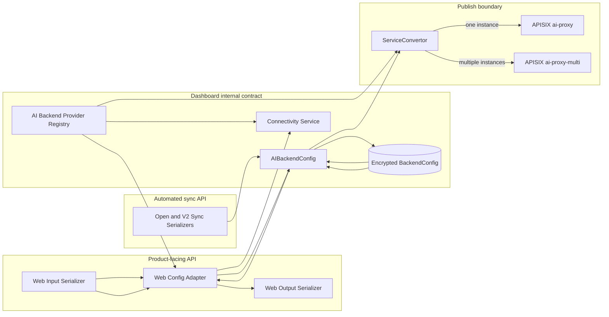
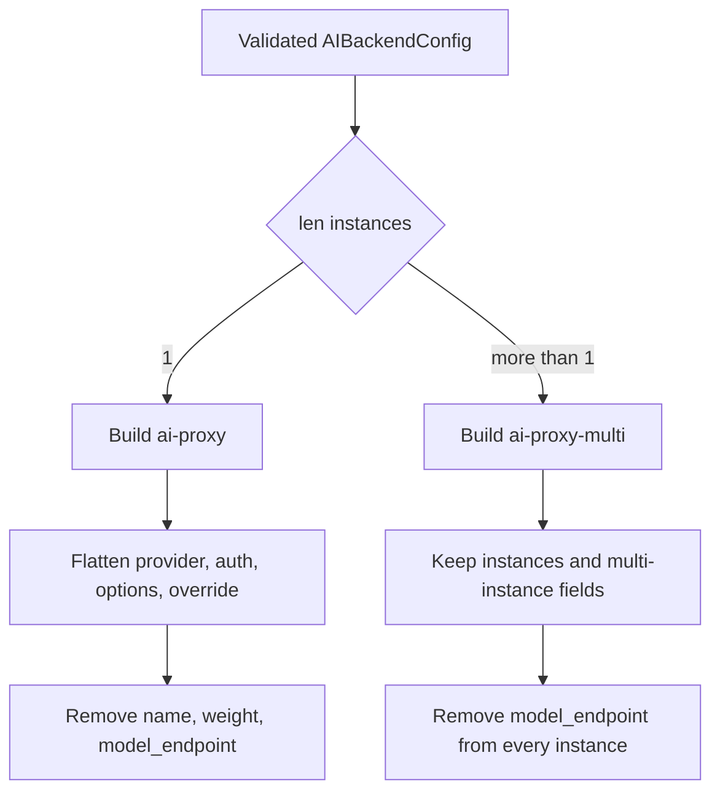

# AI Backend Web Protocol Decoupling Design

Status: approved

Date: 2026-07-21

Target: `upstream/master`

## 1. Purpose

The current Web API accepts and returns a shape that is too close to the APISIX `ai-proxy` / `ai-proxy-multi` configuration. This leaks plugin implementation details into the dashboard form contract and makes product-facing API evolution depend on APISIX schema details.

This change establishes three explicit protocol layers:

1. A stable Web form protocol containing only fields used by the dashboard.
2. A unified stored `AIBackendConfig` protocol that supports one or multiple instances.
3. A publish-time APISIX protocol generated by `ServiceConvertor`.

The Web API uses separate input and output serializers plus a bidirectional adapter. Automated sync APIs use the unified internal protocol directly and remain intentionally coupled to the supported APISIX instance fields.

## 2. Goals

- Keep Web input and output in the same product-facing field shape.
- Hide APISIX instance names, weights, authentication nesting, plugin selection, and multi-instance strategy fields from the Web API.
- Keep the database representation independent from the first-phase single-instance UI limitation.
- Support multiple instances in `AIBackendConfig`, while limiting both Web and automated sync inputs to one instance in the first phase.
- Normalize built-in OpenAI-compatible providers to APISIX `openai-compatible` only when publishing.
- Store timeout values in seconds and convert to milliseconds only when publishing.
- Keep `model_endpoint` as a dashboard extension inside an instance and remove it from the APISIX configuration.
- Validate supported APISIX fields explicitly and reject unknown fields.

## 3. Non-goals

- Changing `src/dashboard-front` in this implementation.
- Preserving the old Web AI Backend request or response protocol.
- Migrating historical AI Backend data; the feature has not entered formal use.
- Generating schemas automatically from APISIX source.
- Calling Chat Completions during a connectivity test.
- Allowing Web or automated sync callers to submit multiple instances in the first phase.
- Supporting providers whose wire protocol is not OpenAI Chat Completions compatible.

Because there is no Web compatibility layer, backend and frontend releases must be coordinated even though frontend code is tracked separately.

## 4. Architecture



The provider registry is runtime-critical configuration, not display metadata. Web conversion, connectivity tests, and publishing must all use the same registry entry.

## 5. Web API contract

### 5.1 Form fields

Each stage configuration uses the following product-facing fields:

| Field | Input rule | Output rule |
| --- | --- | --- |
| `stage_id` | Required stage identifier | Returned unchanged |
| `provider` | Required; `openai`, `deepseek`, or `openai-compatible` | Returned as the product provider stored in the database |
| `endpoint` | Full Chat Completions URL; conditional rules below | Always returned |
| `model_endpoint` | Optional only for `openai-compatible` | Registry value for built-ins; explicit stored value or `null` for custom providers |
| `api_key` | Required for built-ins; forbidden for custom providers | Masked for built-ins |
| `auth_header` | Optional `{name, value}` for custom providers; forbidden for built-ins | Header name plus masked value, or `null` |
| `model` | Optional non-empty string | Stored model or `null` |
| `model_options` | Optional JSON object; must not contain `model` | Returned as a JSON object |
| `timeout` | Integer seconds, default `300`, range `1..300` | Returned in seconds |

The Web serializer rejects internal or APISIX-specific fields including `instances`, `name`, `weight`, `auth`, `options`, `override`, `balancer`, and `fallback_strategy`. Unknown fields are rejected.

`endpoint` means the complete Chat Completions target, for example `https://host/v1/chat/completions`. It is not a base URL.

### 5.2 Built-in providers

For `openai` and `deepseek`:

- The provider registry owns both the Chat Completions endpoint and Models endpoint.
- Web input may omit `endpoint`. If it is submitted, it must exactly equal the current registry endpoint.
- Web input must not submit `model_endpoint`.
- `api_key` is required on create and is mapped to `Authorization: Bearer <api_key>`.
- A custom endpoint requires selecting `openai-compatible`; built-in providers cannot be overridden.
- Web output always returns both registry endpoints, making them read-only display values.

### 5.3 Custom OpenAI-compatible provider

For `openai-compatible`:

- `endpoint` is required.
- `model_endpoint` is optional.
- `auth_header` is optional. If present, `name` and `value` must both be non-empty.
- `api_key` is forbidden.
- Completion and Models endpoints may use different schemes, hosts, or ports. Each URL is validated independently.

### 5.4 Model and options

`model` is optional throughout Web, automation, storage, connectivity, and publishing. When present, it becomes `instances[].options.model`.

`model_options` contains the other request options. It must not contain a `model` key, avoiding two competing sources for the same value. Omitting both `model` and `model_options` is valid.

### 5.5 Web adapter mapping

The Web adapter maps one flat stage form to one internal instance:

```text
provider                 -> instances[0].provider
api_key                  -> instances[0].auth.header.Authorization
auth_header              -> instances[0].auth.header[<name>]
endpoint                 -> instances[0].override.endpoint for openai-compatible
model_endpoint           -> instances[0].model_endpoint
model                    -> instances[0].options.model
model_options            -> remaining instances[0].options entries
timeout                  -> timeout
fixed "primary"          -> instances[0].name
default 0                -> instances[0].weight
```

Built-in endpoints are not stored as overrides. The database retains the product provider, and the registry supplies its endpoints at read, connectivity, and publish time.

The reverse mapping must produce the same form-facing shape and must not expose internal fields.

## 6. Unified stored `AIBackendConfig`

The database stores a normalized `AIBackendConfig`, encrypted through the existing `BackendConfig.config` persistence boundary.

The contract has:

- `timeout` in seconds, default `300`, range `1..300`.
- `instances` with at least one entry and no core-level first-phase maximum.
- Explicit instance fields based on the supported APISIX instance contract.
- Optional instance-local `model_endpoint` as the sole dashboard extension.
- Explicit multi-instance top-level fields based on the supported `ai-proxy-multi` contract.
- `extra="forbid"` behavior at every declared object boundary.
- Rejection of stage/environment variables anywhere in the configuration.

Core validation applies to every instance, not only `instances[0]`.

Base instance rules:

- `name` is a required non-empty string for automated input; the Web adapter supplies `primary`.
- `weight` is an optional non-negative integer with default `0`.
- `provider` is limited in the first phase to `openai`, `deepseek`, and `openai-compatible`.
- `options` and `options.model` are optional.
- Built-ins require a non-empty `Authorization` header, reject `override`, and reject `model_endpoint`.
- `openai-compatible` requires `override.endpoint`; authentication and `model_endpoint` are optional.
- Forbidden transport headers and case-insensitive duplicate header names are rejected.

Multi-instance-only fields must not be accepted when only one instance is provided because publishing as `ai-proxy` would silently discard them.

`model_endpoint` stays inside its instance because completion and model-list endpoints belong to the same destination identity. It is stripped before publishing.

## 7. Automated sync contract

The `/apis/open` and `/apis/v2/sync` serializers accept the unified internal AI configuration rather than the Web form DTO.

This contract is deliberately strongly coupled to the explicitly supported APISIX `ai-proxy` / `ai-proxy-multi` fields:

- Field names, types, and validation semantics are maintained manually against APISIX.
- Unknown fields are rejected rather than automatically passed through.
- Unit and contract tests provide consistency evidence.
- APISIX upgrades require an explicit schema review; there is no generated schema or mirror CI job.

First-phase boundary rules:

- `len(instances)` must equal `1`.
- Multi-instance-only top-level fields are rejected.
- `name` is required.
- `weight` defaults to `0` when omitted.
- Built-in providers require `auth.header.Authorization`.
- Custom providers may omit authentication or provide any valid non-forbidden header.
- Masked credential syntax has no special meaning; automation always submits plaintext configuration.

These restrictions belong to the external Web and automation serializers. The core model and converter remain capable of validating and publishing multiple instances for future use and internal tests.

## 8. Provider registry

`AIBackendProviderRegistry` is independent of the Web layer and is the canonical runtime source for each built-in provider's:

- Product provider identifier.
- Full Chat Completions endpoint.
- Models endpoint.
- OpenAI Chat compatibility classification.

Registry entries are explicit code with safe, statically reviewed URLs. Missing or invalid entries fail closed. A registry change does not rewrite stored rows.

A provider may be normalized to APISIX `openai-compatible` only if it is genuinely OpenAI Chat Completions compatible. A future provider with a different wire protocol requires an explicit design instead of automatic normalization.

Adding a provider requires coordinated updates to provider choices, registry entries, Web adapter rules, connectivity tests, publish tests, and API documentation.

## 9. Connectivity test

Connectivity remains a separate endpoint and is not a prerequisite for create or update. Save operations perform structural and security validation only and make no external request.

The connectivity test issues only a Models API request. It never sends a Chat Completions request.

The Models endpoint is selected in this order:

1. Explicit instance `model_endpoint`, when allowed and present.
2. The built-in provider registry Models endpoint.
3. Derivation from a custom completion endpoint by replacing a terminal `/chat/completions` with `/models`.

Examples:

```text
https://host/v1/chat/completions -> https://host/v1/models
https://host/chat/completions    -> https://host/models
```

An inferred endpoint is never persisted or returned as though it were user configuration. Custom Web output returns `model_endpoint: null` when the value was omitted.

If the completion URL cannot be derived, or the derived Models request fails, the test stops and returns an error recommending an explicit `model_endpoint`. It does not retry another guessed path or fall back to Chat Completions.

Success requires a 2xx response with a valid model-list structure. The response is converted to model identifiers for the Web output.

Both completion and Models URLs require independent outbound-request safety validation:

- Only `http` and `https` schemes.
- A hostname is required.
- URL user information is forbidden.
- Forbidden hosts, ports, DNS results, and redirect destinations cannot bypass SSRF controls.
- Different origins are allowed after both have passed validation.

Errors must be stable, localized API validation errors. They must not expose credentials, complete upstream response bodies, or sensitive transport details.

## 10. Credential masking and update semantics

The existing encrypted persistence boundary remains unchanged. Plaintext credentials may exist only in trusted in-memory paths.

Web output masks `api_key` or `auth_header.value`. On update:

- Submitting the exact existing mask preserves the stored plaintext value.
- Submitting new plaintext replaces the value.
- Omitting custom `auth_header` clears it.
- A masked credential cannot be reused if the provider or actual submitted endpoint origin changes; the user must re-enter the credential.
- Header names compare case-insensitively when restoring a mask, while output preserves the stored spelling.

Automation input never restores masks.

Logs, audit events, serializer errors, and connectivity errors must not expose plaintext credentials, encrypted payloads, or unredacted upstream bodies.

If stored AI configuration cannot be decrypted or validated, reads return a stable error, updates do not overwrite the row implicitly, and publishing stops.

## 11. Publish conversion

`ServiceConvertor` is the only boundary that compiles the stored contract into an APISIX plugin configuration.

For every built-in provider instance it:

1. Looks up the provider registry.
2. Changes the published provider to `openai-compatible`.
3. Adds the registry Chat Completions URL as `override.endpoint`.

For a custom `openai-compatible` instance it preserves the validated override endpoint.

For all instances it:

- Removes `model_endpoint`.
- Converts timeout from seconds to milliseconds exactly once.
- Preserves optional `options.model` only when provided.

Plugin selection is derived from instance count and is never stored or selected by callers:



With one instance, `name` and `weight` are internal fields and are not published to `ai-proxy`. With multiple instances, the converter preserves instance names, weights, and validated multi-instance fields for `ai-proxy-multi`.

Registry lookup or conversion failure stops publishing. No partially converted configuration is emitted.

## 12. Error handling

Web validation errors use form field paths such as `endpoint`, `model_endpoint`, `api_key`, and `model_options.model`.

Automation errors use internal paths such as `instances[0].override.endpoint` and `instances[0].auth.header.Authorization`.

Required error cases include:

- Unknown or internal fields in Web input.
- Unknown APISIX fields in automation input.
- Built-in endpoint differing from its registry value.
- A `model` key inside `model_options`.
- Invalid timeout or instance weight.
- Multiple first-phase instances.
- Multi-instance-only fields with one instance.
- Unsupported provider or invalid provider-specific authentication.
- Missing custom completion endpoint.
- Unsafe completion or Models endpoint.
- Failed or invalid Models API response, including advice to configure `model_endpoint` when an inferred endpoint was used.

## 13. Test strategy

### 13.1 Web contract and adapter

- Field presence, defaults, provider-conditional rules, and unknown-field rejection.
- Built-in endpoint omission, exact registry equality, and override rejection.
- Built-in and custom Web-to-internal mapping.
- Optional model and options, including rejection of `model_options.model`.
- Output reverse mapping, registry endpoint projection, and custom `model_endpoint: null`.
- Credential masking, replacement, clearing, and masked round-trip preservation.
- Credential re-entry when provider or submitted endpoint identity changes.
- Shared adapter use by backend and stage Web APIs.

### 13.2 Automation and core

- First-phase single-instance enforcement at both automated API boundaries.
- Required name, default weight `0`, provider authentication rules, and no mask restoration.
- Rejection of multi-instance-only fields at the single-instance boundary.
- Direct core tests with multiple instances, validation of every index, and supported multi fields.
- Environment-variable and unknown-field rejection.

### 13.3 Connectivity

- Explicit, registry, `/v1/chat/completions`, and `/chat/completions` Models endpoint selection.
- Non-derivable paths and failed derived requests return the configured guidance without fallback.
- Different valid origins are accepted.
- Forbidden schemes, hosts, ports, DNS results, redirects, and malformed model-list responses are rejected.
- Only the Models endpoint is requested.

### 13.4 Publishing

- Each built-in provider becomes `openai-compatible` with the registry override.
- Custom providers retain their validated override.
- `model_endpoint` is absent from published configuration.
- Seconds are converted to milliseconds exactly once.
- One instance produces `ai-proxy` without name or weight.
- Multiple instances produce `ai-proxy-multi` and preserve validated multi fields.
- Ordinary backend conversion is unchanged.

### 13.5 Documentation and regression

- Update the existing AI Gateway design document so it no longer describes Web input as raw `AIBackendConfig`, timeout as stored milliseconds, model as required, top-level `model_endpoint`, or a core single-instance maximum.
- Update OpenAPI/contract examples for Web, `/apis/open`, and `/apis/v2/sync` without running repository OpenAPI generation unless explicitly requested.
- Verify encryption, masking, and audit redaction boundaries.

## 14. Implementation scope

Expected backend areas include:

- `apigateway/core/backend_config.py` for the unified core schema.
- A provider registry outside the Web API package.
- Web backend and stage serializers plus a dedicated Web adapter.
- Open and V2 automated sync serializers.
- AI connectivity endpoint resolution and response parsing.
- `controller/convertor/service.py` publish conversion.
- Focused serializer, adapter, core, connectivity, converter, and persistence tests.
- Contract documentation synchronized with the new protocol.

Frontend code is deliberately excluded. A separate frontend task must update the form DTO, optional model presentation, provider-specific credential fields, endpoint read-only behavior, and connectivity request shape before coordinated release.

## 15. Decision summary

- Web uses a product DTO and an independent bidirectional adapter.
- Automation uses the unified internal protocol directly.
- Storage uses unified `AIBackendConfig`, not final plugin configuration.
- Core supports multiple instances; first-phase external serializers require exactly one.
- Plugin type is derived at publish time from instance count.
- Built-ins stay as product providers in storage and publish as `openai-compatible` using the registry.
- `model`, `model_endpoint`, and custom authentication are optional under their provider rules.
- Timeout is seconds until publish.
- Derived Models endpoints are neither persisted nor returned as explicit configuration.
- Failed inferred Models requests do not fall back.
- APISIX consistency is maintained through explicit schemas, tests, and upgrade review.
- The implementation is backend-only and requires a separately coordinated frontend change.
